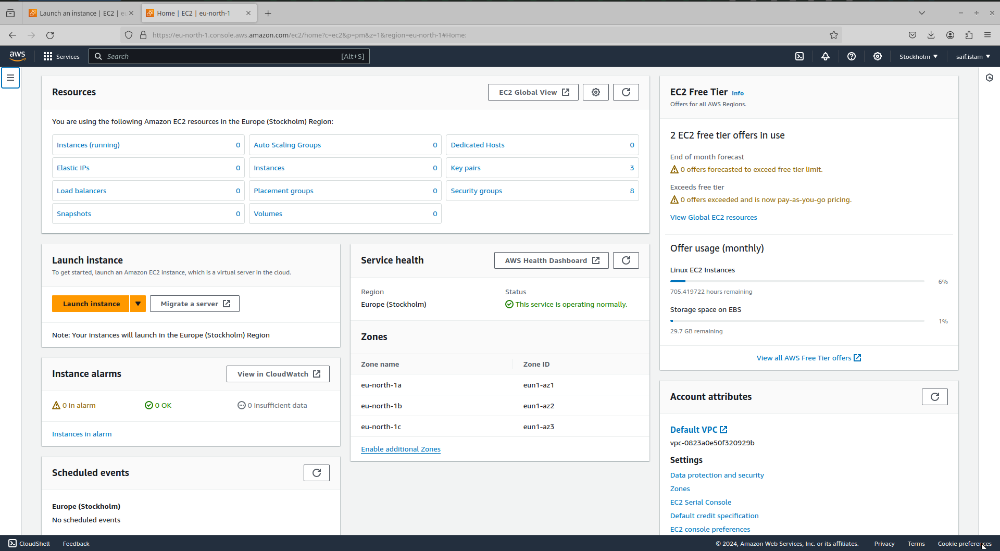

# EC2

An EC2 is a virtual machine offering from AWS.

As per AWS' own words, EC2 provides the following aspects,

1. Secure, reliable computing in the cloud
2. SLA commitment of 99.99% availability
3. Security built in with the [AWS Nitro System](https://aws.amazon.com/ec2/nitro/)
4. Variants include the [AWS Graviton](https://aws.amazon.com/pm/ec2-graviton/) based instances, [AWS EC2 Spot](https://aws.amazon.com/ec2/spot/) instances
5. Integration with AWS Saving Plans

## Dashboard

The dashboard looks similar to this,

A couple of things to notice here,

1. Resources -> current resources being used by EC2 instances
2. Launch Instance -> launch a new EC2 instance
3. Instance Alarms -> cloudwatch related alarms
4. Servce Health -> health status about availability zones
5. EC2 Free Tier -> stats for current free tier usage
6. Account attributes -> VPC related information

Further below, we had the below options,

7. Migrate a server -> moving from physical, cloud, and virtual infra to AWS
8. Explore AWS -> explore more options with AWS
    1. Amazon GuardDuty Malware Protection -> GuardDuty now provides agentless malware detection in Amazon EC2 & EC2 container workloads
    2. T4g instances deliver the best price performance for burstable general purpose workloads in Amazon EC2
    3. Optimize price-performance by combining EC2 purchase options in a single EC2 ASG
9. Addtional informaton -> as expected

## Launch An Instance

If we want to launch an instance, we will have to do the following steps,

1. Name and tags -> set a name for the image along with tags
2. Application and OS Images (Amazon Machine Image) -> AMIs are bundles of an operating system, application server, and applications that come as an `image`
3. Instance Type -> specify the resource constraints for `vCPU`, `RAM`, and generation, along with their pricing
4. Key pair (login) -> an SSH key pair to login into the instance with
5. Network Settings -> configuration options,
    1. Network
    2. Subnet
    3. Auto-assign public IP
    4. Firewall (security groups) -> you can either create a new security group, or select an existing security group. If you choose the "new security group" option, you can select the below options,
        1. Allow SSH traffic from either "Anywhere" (0.0.0.0), a "Custom" IP, or your IP
        2. Allow HTTPS traffic from the internet
        3. Allow HTTP traffic from the internet
6. Storage -> this has two variants,
    1. "Configure storage" -> as simple as it comes. This helps to specify the amount of storage we want to attach to our instance. By default (and the minimum) is set to 8 GBs of `gp3`. `gp3` is a type of `EBS Volume`, along with `gp2`, `Io1`, and `Io2`. Some relevant links are the following,
        1. [Comparing Amazon EBS volume types gp2 and gp3](https://docs.aws.amazon.com/emr/latest/ManagementGuide/emr-plan-storage-compare-volume-types.html)
        2. [Choose the best Amazon EBS volume type for your self-managed database deployment](https://aws.amazon.com/blogs/storage/how-to-choose-the-best-amazon-ebs-volume-type-for-your-self-managed-database-deployment/)
        3. We can also more than one set of "volumes"
    2. "EBS Volumes" -> highly granular level of control
        1. You can specify,
            1. `Storage Type`
            2. `Device name`
            3. `Snapshot`
            4. `Size (GiB)`
            5. `Volume type`
            6. `IOPS`
            7. `Delete on termination`
            8. `Encrypted`
            9. `KMS Key`
            10. `Throughput`
        2. Free tier eligible customers can get up to 30 GB of EBS General Purpose (SSD) or Magnetic storage
        3. You ca also add new volumes
        4. Further, we can also choose `File systems`, and then we see further two options,
            1. EFS -> Elastic File Storage
            2. FSx -> Amazon FSx

## Related Resources

- [Instances (running)](https://eu-north-1.console.aws.amazon.com/ec2/home?c=ec2&p=pm&z=1&region=eu-north-1#Instances:instanceState=running)
- [Auto Scaling Groups](https://eu-north-1.console.aws.amazon.com/ec2/home?c=ec2&p=pm&z=1&region=eu-north-1#AutoScalingGroups:)
- [Dedicated Hosts](https://eu-north-1.console.aws.amazon.com/ec2/home?c=ec2&p=pm&z=1&region=eu-north-1#Hosts:)
- [Elastic IPs](https://eu-north-1.console.aws.amazon.com/ec2/home?c=ec2&p=pm&z=1&region=eu-north-1#Addresses:)
- [Instances](https://eu-north-1.console.aws.amazon.com/ec2/home?c=ec2&p=pm&z=1&region=eu-north-1#Instances:)
- [Key Pairs](https://eu-north-1.console.aws.amazon.com/ec2/home?c=ec2&p=pm&z=1&region=eu-north-1#KeyPairs:)
- [Load Balancers](https://eu-north-1.console.aws.amazon.com/ec2/home?c=ec2&p=pm&z=1&region=eu-north-1#LoadBalancers:)
- [Placement Groups](https://eu-north-1.console.aws.amazon.com/ec2/home?c=ec2&p=pm&z=1&region=eu-north-1#PlacementGroups:)
- [Security Groups](https://eu-north-1.console.aws.amazon.com/ec2/home?c=ec2&p=pm&z=1&region=eu-north-1#SecurityGroups:)
- [Snapshots](https://eu-north-1.console.aws.amazon.com/ec2/home?c=ec2&p=pm&z=1&region=eu-north-1#Snapshots:)
- [Volumes](https://eu-north-1.console.aws.amazon.com/ec2/home?c=ec2&p=pm&z=1&region=eu-north-1#Volumes:)

## Links

- [AWS EC2](https://aws.amazon.com/pm/ec2/)
- [Dashboard](https://eu-north-1.console.aws.amazon.com/ec2/home)
- [EC2 Instance Types](https://docs.aws.amazon.com/AWSEC2/latest/UserGuide/instance-types.html)
