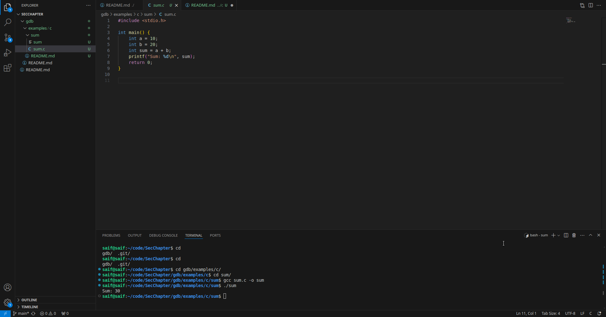
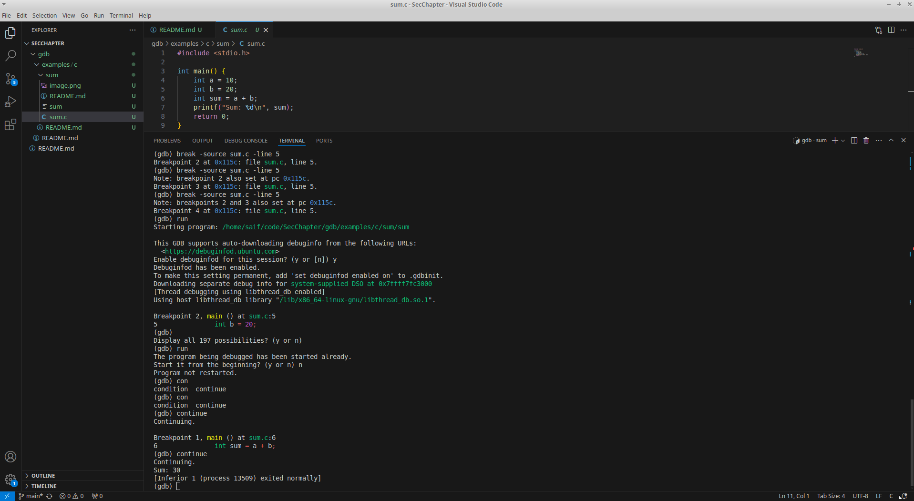
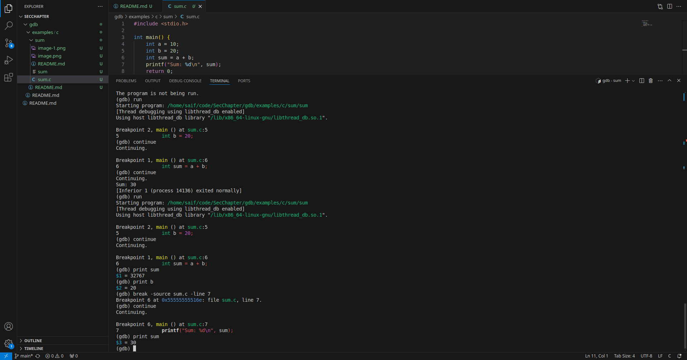
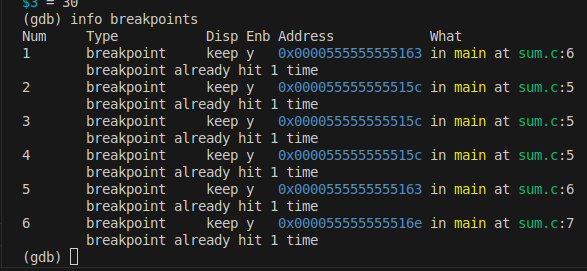
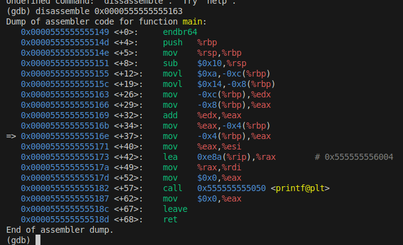

# Sum

Adds two numbers together, prints output.

Using the command line, and entering the `gdb` interactive session mode, we can experiment a bit with the commands that `gdb` has to offer,

Further, we can try experimenting what the output values are with the `print` command now that we know how to set breakpoints, run, and continue,

We can get the info about the breakpoints using the `info breakpoints` command,

We can get the assembly as well for the breakpoints using the memory address that we can see listed in the `Address` column,

