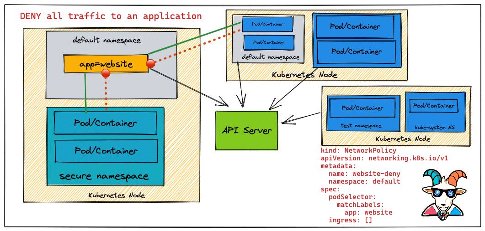

# ⎈ Secure Network Boundaries using NSP

## 🙌 Overview

As you have seen in some of the scenarios and in general Kubernetes comes with a flat networking schema. This means if you wanted to create network boundaries, you will need to create something called a Network Policy with the help of CNI. In this scenario, we will be looking at a simple use case of how you can create a Network Policy to restrict traffic and create network security boundaries between Kubernetes resources.



By the end of the scenario, you will understand and learn the following:

1. You will learn to work with Network Policies in Kubernetes Cluster
2. Understand and work with basic Kubernetes `kubectl` commands and interact with pods & services
3. Creating and destroying Kubernetes resources and restricting the traffic using NSPs

### ⚡️ The story

This scenario is to deploy a simple Network Security Policy for Kubernetes resources to create security boundaries.

:::info

To get started with this scenario, please ensure you are using a networking solution that supports `NetworkPolicy`

:::

### 🎯 Goal

:::tip

Create a Network Policy to drop the access to the `website` service to complete this scenario.

:::

### 🪄 Hints & Spoilers

<details>
  <summary><b>✨ What is NSP and how to learn? </b></summary>
  <div>
    <div>Let's look at official docs <a href="https://kubernetes.io/docs/concepts/services-networking/network-policies/">Network Policies</a>. 
      
  Also there is a detailed explanation of NSP with examples by Ahmet Alp Balkan <a href="https://github.com/ahmetb/kubernetes-network-policy-recipes">here</a>🙌</div>
  </div>
</details>

## 🎉 Solution & Walkthrough

### 🎲 Method 1

:::note

Refer to [https://github.com/ahmetb/kubernetes-network-policy-recipes](https://github.com/ahmetb/kubernetes-network-policy-recipes) for more recipes and a detailed explanation of Network Security Policies with examples and details.

:::

- Let's run the Nginx container with `app=website` labels and expose it via port 80

``` bash
kubectl run --image=nginx website --labels app=website --expose --port 80
```

- Now, let's run a temporary pod to make a simple HTTP request to the `website` service

```bash
kubectl run --rm -it --image=alpine temp -- sh
```

- Let's make a simple HTTP request using `wget` to the website service

```bash
wget -qO- http://website
```


- So far it works perfectly fine. Now let's create a Network Policy and apply it to the Kubernetes cluster to block/deny any requests.

```YAML title="website-deny.yaml"
kind: NetworkPolicy
apiVersion: networking.k8s.io/v1
metadata:
  name: website-deny
spec:
  podSelector:
    matchLabels:
      app: website
  ingress: []
```

- Let's deploy this NSP policy to the cluster by running the following command:

```bash
kubectl apply -f website-deny.yaml
```

- Now, let's retry a HTTP request to our `website` service

```bash
kubectl run --rm -it --image=alpine temp -- sh
```

- Let's run the `wget` query to access the website

```bash
wget -qO- --timeout=2 http://website
```


- As you can see the Network Policy is dropping the traffic and you are not able to access the website now.

- You can remove all the applied resources and clean up by running the following commands

```bash
kubectl delete pod website
kubectl delete service website
kubectl delete networkpolicy website-deny
```

- Hooray 🥳 , now you have successfully learned how to implement and work with Network Policies in Kubernetes Clusters!

## 🔖 References

- [Kubernetes Network Policies](https://kubernetes.io/docs/concepts/services-networking/network-policies/)
- [Kubernetes Network Policy Recipes by Ahmet Alp Balkan](https://github.com/ahmetb/kubernetes-network-policy-recipes)
- [Network Policy Editor for Kubernetes](https://editor.cilium.io/)
