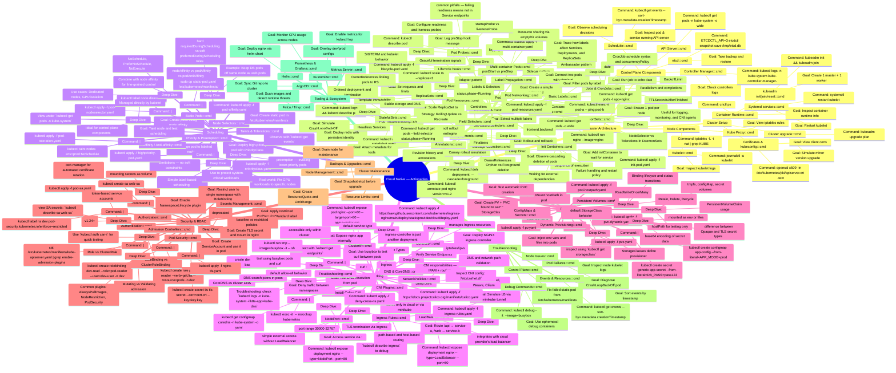

# Roadmap

```mermaid
mindmap
  root((Cloud Native — Actionables))
    Cluster Architecture
      Control Plane Components
        API Server:::cmd
          Goal: Inspect pod & service running API server  
          Command: kubectl get pods -n kube-system -o wide
        Controller Manager:::cmd
          Goal: Check controllers logs  
          Command: kubectl logs -n kube-system kube-controller-manager-<node>
        Scheduler:::cmd
          Goal: Observe scheduling decisions  
          Command: kubectl get events --sort-by=.metadata.creationTimestamp
        etcd:::cmd
          Goal: Take backup and restore  
          Command: ETCDCTL_API=3 etcdctl snapshot save /tmp/etcd.db
      Node Components
        Kubelet:::cmd
          Goal: Inspect kubelet logs  
          Command: journalctl -u kubelet
        Kube Proxy:::cmd
          Goal: View iptables rules  
          Command: iptables -L -t nat | grep KUBE
        Container Runtime:::cmd
          Goal: Inspect container runtime info  
          Command: crictl ps
      Cluster Setup
        kubeadm init/join/reset:::cmd
          Goal: Create 1 master + 1 worker  
          Command: kubeadm init && kubeadm join <token>
        Certificates & kubeconfig:::cmd
          Goal: View client certs  
          Command: openssl x509 -in /etc/kubernetes/pki/apiserver.crt -text
        Systemd services:::cmd
          Goal: Restart kubelet  
          Command: systemctl restart kubelet
        Cluster upgrade:::cmd
          Goal: Simulate minor version upgrade  
          Command: kubeadm upgrade plan
    Workloads & Controllers
        Pods
        Single-Container Pods:::cmd
            Goal: Create a simple nginx pod  
            Command: kubectl run nginx --image=nginx
        Multi-container Pods:::cmd
            Goal: Create pod with sidecar (logging)  
            Command: kubectl apply -f multi-container.yaml
            Deep Dive:
            Sidecar pattern  
            Ambassador pattern  
            Adapter pattern  
            Resource sharing via emptyDir volumes
        Init Containers:::cmd
            Goal: Add initContainer to wait for service  
            Command: kubectl apply -f init-pod.yaml
            Deep Dive:
            Sequence of execution  
            Failure handling and restart policy  
            Waiting for external dependencies
        Lifecycle hooks:::cmd
            Goal: Log preStop hook message  
            Command: kubectl apply -f lifecycle-pod.yaml
            Deep Dive:
            postStart vs preStop  
            Graceful termination signals  
            SIGTERM and kubelet behavior
        Pod Probes:::cmd
            Goal: Configure readiness and liveness probes  
            Command: kubectl describe pod <pod>
            Deep Dive:
            startupProbe vs livenessProbe  
            common pitfalls — failing readiness means not in Service endpoints
        Pod Resources:::cmd
            Goal: Set requests and limits  
            Command: kubectl apply -f pod-resources.yaml
        Pod Networking:::cmd
            Goal: Connect two pods with ping/curl  
            Command: kubectl exec -it pod-a -- ping pod-b
        Pod Troubleshooting:::cmd
            Goal: Simulate CrashLoopBackOff  
            Command: kubectl logs <pod> && kubectl describe pod <pod>

        Controllers
        ReplicaSets:::cmd
            Goal: Scale ReplicaSet to 3 replicas  
            Command: kubectl scale rs <name> --replicas=3
            Deep Dive:
            Template immutability  
            OwnerReferences linking pods to RS
        Deployments:::cmd
            Goal: Rollout and rollback  
            Command: kubectl rollout undo deployment/nginx
            Deep Dive:
            Strategy: RollingUpdate vs Recreate  
            Revision history and annotations  
            Canary rollout simulation
        DaemonSets:::cmd
            Goal: Ensure 1 pod per node  
            Command: kubectl get pods -o wide
            Deep Dive:
            NodeSelector vs Tolerations in DaemonSets  
            Useful for logging, monitoring, and CNI agents
        StatefulSets:::cmd
            Goal: Deploy redis with persistent identity  
            Command: kubectl apply -f statefulset.yaml
            Deep Dive:
            Headless Services  
            Stable storage and DNS  
            Ordered deployment and termination
        Jobs & CronJobs:::cmd
            Goal: Run job to echo date  
            Command: kubectl create job datejob --image=busybox -- echo $(date)
            Deep Dive:
            BackoffLimit  
            TTLSecondsAfterFinished  
            Parallelism and completions  
            CronJob schedule syntax and concurrencyPolicy
        Garbage Collection:::cmd
            Goal: Observe cascading deletion of pods  
            Command: kubectl delete deployment <name> --cascade=foreground
            Deep Dive:
            OwnerReferences  
            Finalizers  
            Orphan vs Foreground deletion

        Labels & Selectors
        Basic Labels:::cmd
            Goal: Filter pods by label  
            Command: kubectl get pods -l app=nginx
        Set-Based Selectors:::cmd
            Goal: Select multiple labels  
            Command: kubectl get pods -l tier in (frontend,backend)
        Annotations:::cmd
            Goal: Attach metadata for tools  
            Command: kubectl annotate pod nginx version=v1.2
        Field Selectors:::cmd
            Goal: Filter by fields (status.phase=Running)  
            Command: kubectl get pods --field-selector status.phase=Running
        Label Propagation:::cmd
            Goal: Trace how labels affect Services, Deployments, and ReplicaSets

    Scheduling
        Node Selectors:::cmd
        Goal: Assign pod to labeled node  
        Command: |
            kubectl label node <node> disk=ssd
            kubectl apply -f pod-nodeselector.yaml
        Deep Dive:
            Simple label-based scheduling  
            Limitations — no soft constraints  
            Real-world: Pin GPU workloads to specific nodes
        Affinity / Anti-affinity:::cmd
        Goal: Create pods using node affinity  
        Command: kubectl apply -f pod-affinity.yaml
        Deep Dive:
            nodeAffinity vs podAffinity vs podAntiAffinity  
            hard requiredDuringScheduling vs soft preferredDuringScheduling rules  
            Example: Keep DB pods off same node as web pods
        Taints & Tolerations:::cmd
        Goal: Taint node and test scheduling  
        Command: |
            kubectl taint nodes <node> env=prod:NoSchedule
            kubectl apply -f pod-toleration.yaml
        Deep Dive:
            NoSchedule, PreferNoSchedule, NoExecute  
            Use cases: Dedicated nodes, GPU isolation  
            Combine with node affinity for fine-grained control
        Priority & Preemption:::cmd
        Goal: Deploy high-priority pod with PriorityClass  
        Command: |
            kubectl apply -f priorityclass.yaml
            kubectl apply -f highpriority-pod.yaml
        Deep Dive:
            preemption — evicting lower-priority pods  
            Use to protect system-critical workloads  
            Observe with `kubectl get events`
        Static Pods:::cmd
        Goal: Create static pod in /etc/kubernetes/manifests  
        Command: |
            sudo cp static-pod.yaml /etc/kubernetes/manifests/
        Deep Dive:
            Managed directly by kubelet  
            Ideal for control plane components  
            View under `kubectl get pods -n kube-system`

    Networking
        Service Types
        ClusterIP:::cmd
            Goal: Expose nginx app internally  
            Command: kubectl expose pod nginx --port=80 --target-port=80 --name=nginx-svc
            Deep Dive:
            default service type  
            accessible only within cluster  
            Inspect with `kubectl get endpoints`
        NodePort:::cmd
            Goal: Access service via <NodeIP>:<Port>  
            Command: kubectl expose deployment nginx --type=NodePort --port=80
            Deep Dive:
            port range 30000-32767  
            simple external access without LoadBalancer
        LoadBalancer:::cmd
            Goal: Simulate LB via minikube tunnel  
            Command: kubectl expose deployment nginx --type=LoadBalancer --port=80
            Deep Dive:
            works only in cloud or via minikube  
            integrates with cloud provider's load balancer
        Ingress
        Controller:::cmd
            Goal: Deploy NGINX ingress controller  
            Command: kubectl apply -f https://raw.githubusercontent.com/kubernetes/ingress-nginx/main/deploy/static/provider/cloud/deploy.yaml
            Deep Dive:
            ingress-controller is just another deployment  
            manages Ingress resources
        Ingress Rules:::cmd
            Goal: Route /api → service-a, /web → service-b  
            Command: kubectl apply -f ingress-rules.yaml
            Deep Dive:
            path-based and host-based routing  
            TLS termination via Ingress  
            `kubectl describe ingress` to debug
        DNS & CoreDNS:::cmd
        Goal: Test DNS resolution from pod  
        Command: |
            kubectl exec -it <pod> -- nslookup kubernetes
            kubectl get configmap coredns -n kube-system -o yaml
        Deep Dive:
            CoreDNS as cluster DNS  
            DNS search paths in pods  
            Troubleshooting: check `kubectl logs -n kube-system -l k8s-app=kube-dns`
        CNI Plugins:::cmd
        Goal: Install Calico CNI  
        Command: kubectl apply -f https://docs.projectcalico.org/manifests/calico.yaml
        Deep Dive:
            CNI responsibilities — IPAM + routing  
            Alternatives: Flannel, Weave, Cilium  
            Inspect CNI config: `/etc/cni/net.d/`
        NetworkPolicies:::cmd
        Goal: Deny traffic between namespaces  
        Command: kubectl apply -f deny-cross-ns.yaml
        Deep Dive:
            default allow-all behavior  
            create deny-by-default baseline  
            test using busybox pods and curl
        Troubleshooting:::cmd
        Goal: Use busybox to test curl between pods  
        Command: |
            kubectl run tmp --image=busybox -it -- sh
            curl <svc-ip>:<port>
        Deep Dive:
            Verify Service Endpoints  
            DNS and network path validation  
            Node-level packet filtering (iptables/ipvs)

    Storage
        Volumes:::cmd
        Goal: Mount hostPath in pod  
        Command: kubectl apply -f pod-hostpath.yaml
        Deep Dive:
            hostPath for testing only  
            tmpfs, configMap, secret volumes  
            PersistentVolumeClaim usage
        Persistent Volumes:::cmd
        Goal: Create PV + PVC bound to same StorageClass  
        Command: |
            kubectl apply -f pv.yaml
            kubectl apply -f pvc.yaml
        Deep Dive:
            reclaimPolicy (Retain, Delete, Recycle)  
            accessModes (ReadWriteOnce/Many)  
            Binding lifecycle and status transitions
        Dynamic Provisioning:::cmd
        Goal: Test automatic PVC creation  
        Command: kubectl apply -f pvc-dynamic.yaml
        Deep Dive:
            StorageClasses define provisioner  
            default StorageClass behavior  
            inspect using `kubectl get storageclass`
        ConfigMaps & Secrets:::cmd
        Goal: Inject env vars and files into pods  
        Command: |
            kubectl create configmap app-config --from-literal=APP_MODE=prod
            kubectl create secret generic app-secret --from-literal=DB_PASS=pass123
        Deep Dive:
            mounted as env or files  
            difference between Opaque and TLS secret types  
            base64 encoding of secret data

    Security & RBAC
        Authentication:::cmd
        Goal: Create ServiceAccount and use it in pod  
        Command: |
            kubectl create sa web-sa
            kubectl apply -f pod-sa.yaml
        Deep Dive:
            token-based service accounts  
            projected service account tokens (v1.24+)  
            view SA secrets: `kubectl describe sa web-sa`
        Authorization:::cmd
        Goal: Restrict user to single namespace with RoleBinding  
        Command: |
            kubectl create role pod-reader --verb=get,list --resource=pods -n dev
            kubectl create rolebinding dev-read --role=pod-reader --user=dev-user -n dev
        Deep Dive:
            Role vs ClusterRole  
            RoleBinding vs ClusterRoleBinding  
            Use `kubectl auth can-i` for quick testing
        Admission Controllers:::cmd
        Goal: Enable NamespaceLifecycle plugin  
        Command: |
            cat /etc/kubernetes/manifests/kube-apiserver.yaml | grep enable-admission-plugins
        Deep Dive:
            Mutating vs Validating admission  
            Common plugins: AlwaysPullImages, NodeRestriction, PodSecurity
        Pod Security:::cmd
        Goal: Apply restricted PodSecurityStandard label  
        Command: |
            kubectl label ns dev pod-security.kubernetes.io/enforce=restricted
        Deep Dive:
            baseline vs restricted policies  
            replacement of PodSecurityPolicy (deprecated)
        Secrets Management:::cmd
        Goal: Create TLS secret and mount in nginx  
        Command: |
            kubectl create secret tls tls-secret --cert=cert.crt --key=key.key
            kubectl apply -f nginx-tls.yaml
        Deep Dive:
            mounting secrets as volume  
            cert-manager for automated certificate rotation

    Cluster Maintenance
      Backups & Upgrades:::cmd
        Goal: Snapshot etcd before upgrade
      Node Management:::cmd
        Goal: Drain node for maintenance
      Resource Limits:::cmd
        Goal: Create ResourceQuota and LimitRange

    Troubleshooting
      Pod Failures:::cmd
        Goal: Diagnose CrashLoopBackOff pod
      Node Issues:::cmd
        Goal: Inspect node kubelet logs
      Control Plane:::cmd
        Goal: Fix failed static pod from /etc/kubernetes/manifests
      Debug Commands:::cmd
        Goal: Use ephemeral debug containers  
        Command: kubectl debug -it <pod> --image=busybox
      Events & Resources:::cmd
        Goal: Sort events by timestamp  
        Command: kubectl get events --sort-by=.metadata.creationTimestamp

    Tooling & Ecosystem
      Helm:::cmd
        Goal: Deploy nginx via helm chart
      Kustomize:::cmd
        Goal: Overlay dev/prod configs
      ArgoCD:::cmd
        Goal: Sync Git repo to cluster
      Prometheus & Grafana:::cmd
        Goal: Monitor CPU usage across nodes
      Metrics Server:::cmd
        Goal: Enable metrics for kubectl top
      Falco / Trivy:::cmd
        Goal: Scan images and detect runtime threats
```
