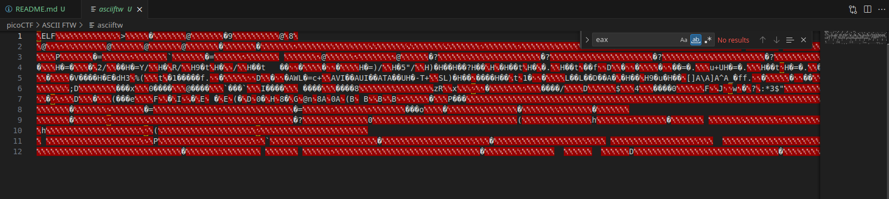
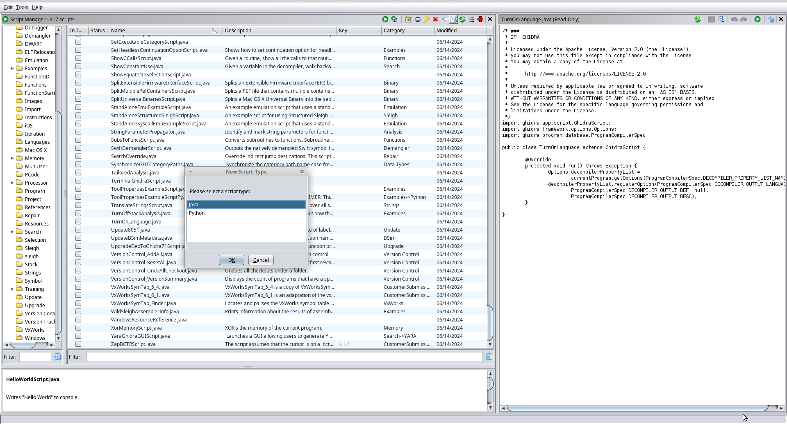

# ASCII FTW

The file is completely unreadable,



We get the meta info about the file,

```
saif@saif:~/code/SecChapter/picoCTF/ASCII FTW$ file asciiftw 
asciiftw: ELF 64-bit LSB pie executable, x86-64, version 1 (SYSV), dynamically linked, interpreter /lib64/ld-linux-x86-64.so.2, BuildID[sha1]=e1c32dace8ac1516160b771e493f5ebffcac9855, for GNU/Linux 3.2.0, not stripped
```

If we try to execute it, we get a message,

```
saif@saif:~/code/SecChapter/picoCTF/ASCII FTW$ sudo chmod +x asciiftw 
[sudo] password for saif: 
saif@saif:~/code/SecChapter/picoCTF/ASCII FTW$ ./asciiftw 
The flag starts with 70
```

If we try to execute `strings` on it, we get the below output,

```
/lib64/ld-linux-x86-64.so.2
libc.so.6
__stack_chk_fail
printf
__cxa_finalize
__libc_start_main
GLIBC_2.2.5
GLIBC_2.4
_ITM_deregisterTMCloneTable
__gmon_start__
_ITM_registerTMCloneTable
u+UH
[]A\A]A^A_
The flag starts with %x
:*3$"
GCC: (Ubuntu 9.4.0-1ubuntu1~20.04.1) 9.4.0
crtstuff.c
deregister_tm_clones
__do_global_dtors_aux
completed.8061
__do_global_dtors_aux_fini_array_entry
frame_dummy
__frame_dummy_init_array_entry
asciiftw.c
__FRAME_END__
__init_array_end
_DYNAMIC
__init_array_start
__GNU_EH_FRAME_HDR
_GLOBAL_OFFSET_TABLE_
__libc_csu_fini
_ITM_deregisterTMCloneTable
_edata
__stack_chk_fail@@GLIBC_2.4
printf@@GLIBC_2.2.5
__libc_start_main@@GLIBC_2.2.5
__data_start
__gmon_start__
__dso_handle
_IO_stdin_used
__libc_csu_init
__bss_start
main
__TMC_END__
_ITM_registerTMCloneTable
__cxa_finalize@@GLIBC_2.2.5
.symtab
.strtab
.shstrtab
.interp
.note.gnu.property
.note.gnu.build-id
.note.ABI-tag
.gnu.hash
.dynsym
.dynstr
.gnu.version
.gnu.version_r
.rela.dyn
.rela.plt
.init
.plt.got
.plt.sec
.text
.fini
.rodata
.eh_frame_hdr
.eh_frame
.init_array
.fini_array
.dynamic
.data
.bss
.comment
```

We get a bit of interesting output,

```
u+UH
[]A\A]A^A_
The flag starts with %x
:*3$"
```

Let's move to the state of disassembling the code for this,

```sh
objdump -d ./asciiftw > dissembly.txt
```

If we view the contents of this `.txt` file, we can see the following output,

```
0000000000001169 <main>:
    1169:	f3 0f 1e fa          	endbr64
    116d:	55                   	push   %rbp
    116e:	48 89 e5             	mov    %rsp,%rbp
    1171:	48 83 ec 30          	sub    $0x30,%rsp
    1175:	64 48 8b 04 25 28 00 	mov    %fs:0x28,%rax
    117c:	00 00 
    117e:	48 89 45 f8          	mov    %rax,-0x8(%rbp)
    1182:	31 c0                	xor    %eax,%eax
    1184:	c6 45 d0 70          	movb   $0x70,-0x30(%rbp)
    1188:	c6 45 d1 69          	movb   $0x69,-0x2f(%rbp)
    118c:	c6 45 d2 63          	movb   $0x63,-0x2e(%rbp)
    1190:	c6 45 d3 6f          	movb   $0x6f,-0x2d(%rbp)
    1194:	c6 45 d4 43          	movb   $0x43,-0x2c(%rbp)
    1198:	c6 45 d5 54          	movb   $0x54,-0x2b(%rbp)
    119c:	c6 45 d6 46          	movb   $0x46,-0x2a(%rbp)
    11a0:	c6 45 d7 7b          	movb   $0x7b,-0x29(%rbp)
    11a4:	c6 45 d8 41          	movb   $0x41,-0x28(%rbp)
    11a8:	c6 45 d9 53          	movb   $0x53,-0x27(%rbp)
    11ac:	c6 45 da 43          	movb   $0x43,-0x26(%rbp)
    11b0:	c6 45 db 49          	movb   $0x49,-0x25(%rbp)
    11b4:	c6 45 dc 49          	movb   $0x49,-0x24(%rbp)
    11b8:	c6 45 dd 5f          	movb   $0x5f,-0x23(%rbp)
    11bc:	c6 45 de 49          	movb   $0x49,-0x22(%rbp)
    11c0:	c6 45 df 53          	movb   $0x53,-0x21(%rbp)
    11c4:	c6 45 e0 5f          	movb   $0x5f,-0x20(%rbp)
    11c8:	c6 45 e1 45          	movb   $0x45,-0x1f(%rbp)
    11cc:	c6 45 e2 41          	movb   $0x41,-0x1e(%rbp)
    11d0:	c6 45 e3 53          	movb   $0x53,-0x1d(%rbp)
    11d4:	c6 45 e4 59          	movb   $0x59,-0x1c(%rbp)
    11d8:	c6 45 e5 5f          	movb   $0x5f,-0x1b(%rbp)
    11dc:	c6 45 e6 38          	movb   $0x38,-0x1a(%rbp)
    11e0:	c6 45 e7 39          	movb   $0x39,-0x19(%rbp)
    11e4:	c6 45 e8 36          	movb   $0x36,-0x18(%rbp)
    11e8:	c6 45 e9 30          	movb   $0x30,-0x17(%rbp)
    11ec:	c6 45 ea 46          	movb   $0x46,-0x16(%rbp)
    11f0:	c6 45 eb 30          	movb   $0x30,-0x15(%rbp)
    11f4:	c6 45 ec 41          	movb   $0x41,-0x14(%rbp)
    11f8:	c6 45 ed 46          	movb   $0x46,-0x13(%rbp)
    11fc:	c6 45 ee 7d          	movb   $0x7d,-0x12(%rbp)
    1200:	0f b6 45 d0          	movzbl -0x30(%rbp),%eax
    1204:	0f be c0             	movsbl %al,%eax
    1207:	89 c6                	mov    %eax,%esi
    1209:	48 8d 3d f4 0d 00 00 	lea    0xdf4(%rip),%rdi        # 2004 <_IO_stdin_used+0x4>
    1210:	b8 00 00 00 00       	mov    $0x0,%eax
    1215:	e8 56 fe ff ff       	call   1070 <printf@plt>
    121a:	90                   	nop
    121b:	48 8b 45 f8          	mov    -0x8(%rbp),%rax
    121f:	64 48 33 04 25 28 00 	xor    %fs:0x28,%rax
    1226:	00 00 
    1228:	74 05                	je     122f <main+0xc6>
    122a:	e8 31 fe ff ff       	call   1060 <__stack_chk_fail@plt>
    122f:	c9                   	leave
    1230:	c3                   	ret
    1231:	66 2e 0f 1f 84 00 00 	cs nopw 0x0(%rax,%rax,1)
    1238:	00 00 00 
    123b:	0f 1f 44 00 00       	nopl   0x0(%rax,%rax,1)
```

We have a large set of `movb` instructions.

While we do not know exactly what is being moved on, it seems to be that the value has been read into `rbp` somehow, and it is being inserted character by character into certain addresses.

Let's use `Ghidra` to write and execute a script to iterate over the addresses and get the values out. We want to first create a new script in `Python`,



Let us first find the starting point to iterate over,


Let us pick out the addresses to iterate over,

```python
from ghidra.program.model.mem import MemoryAccessException

start_addr = currentProgram.getAddressFactory().getAddress("00101184")
end_addr = currentProgram.getAddressFactory().getAddress("001011fc")

byte_list = []
current_addr = start_addr
```

Next, we want to iterate over the addresses and base our logic based on the operand,

```python
while current_addr <= end_addr:
	instruction = getInstructionAt(current_addr)
	if instruction is not None:
		operand = instruction.getOpObjects(1)[0]
		byte_list.append(operand.getValue() & 0xFF) # Read the `masking` section about why we're performing an AND here
	current_addr = current_addr.next()

print(''.join(list(map(chr, byte_list))))
```

After combining the above steps, and run this script, we get the following output,


## Masking with 0xFF

Performing an AND operation (`&`) with `0xFF` on a byte is a way to ensure that only the least significant 8 bits 
of the byte are considered. This is particularly useful in scenarios where you want to treat a signed byte as an 
unsigned byte. Here’s how it works:

### Byte Representation

A byte is typically 8 bits long. In most systems, bytes can be signed (range from -128 to 127) or unsigned (range
from 0 to 255). When you perform an AND operation with `0xFF` (which is `11111111` in binary), you effectively
mask out the higher bits, ensuring that only the lowest 8 bits are considered.

### Example with Signed Byte

Consider the following signed byte in a typical 8-bit two's complement system:

- **Signed Byte**: `-1`
- **Binary Representation**: `11111111` (In two's complement, `-1` is represented as all bits set to 1)

When this byte is interpreted as an unsigned value:

- **Unsigned Byte Interpretation**: `255`
- **Binary Representation**: `11111111` (Unsigned interpretation considers this as 255)

### Using the AND Operation

The AND operation with `0xFF` ensures that only the least significant 8 bits are kept:

```c
signed char signed_byte = -1; // -1 in two's complement: 11111111
unsigned char unsigned_byte = signed_byte & 0xFF;
```

Here’s what happens in binary:

1. **Signed Byte (Binary)**: `11111111`
2. **Mask (0xFF in Binary)**: `11111111`
3. **AND Operation**: `11111111 & 11111111 = 11111111`

The result is `11111111` in binary, which is `255` when interpreted as an unsigned value.

### Why It Works

- **Preservation of Bits**: The AND operation with `0xFF` preserves the lower 8 bits of the original byte.
- **Unsigned Conversion**: The result of the AND operation is interpreted as an unsigned value, converting any
signed byte to its corresponding unsigned representation.

### Practical Example

Let’s say you read a byte from a file or network stream, and you want to ensure it’s treated as an unsigned
value regardless of its original signed interpretation:

```c
char signed_byte = -128; // Binary: 10000000 (signed)
unsigned char unsigned_byte = signed_byte & 0xFF; // Binary: 10000000 (unsigned)

printf("Unsigned Byte: %u\n", unsigned_byte); // Output: 128
```

In this example, `-128` (binary `10000000`) is converted to `128` in unsigned representation using the AND operation with `0xFF`.

### Conclusion

Performing an AND operation with `0xFF` effectively masks out all but the least significant 8 bits of a byte, ensuring
that any signed byte is correctly interpreted as an unsigned value. This technique is useful for dealing with data that
might be signed but needs to be treated as unsigned for further processing.
