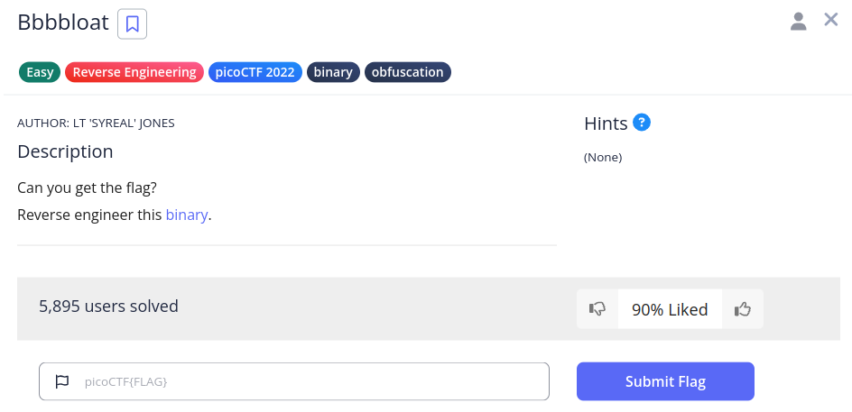

# Bbbbbloat

We have this challenge,



It gave us a file `Bbbbloat`.

If we run it,

```sh
(env) saif@saif:~/code/SecChapter/picoCTF/Bbbbloat$ ./bbbbloat 
What's my favorite number? 42
Sorry, that's not it!
```

If we decompile with `ghidra` from the [online decompiler](https://dogbolt.org/?id=0a3e726a-d8d3-43d4-948a-df318065d3cd#Ghidra=298), we get attached `bloat.c` file

From `bloat.c`, we find this snippet,

```c
undefined8 FUN_00101307(void) {
  long in_FS_OFFSET;
  int local_48;
  char *local_40;
  undefined8 local_38;
  undefined8 local_30;
  undefined8 local_28;
  undefined8 local_20;
  long local_10;
  
  local_10 = *(long *)(in_FS_OFFSET + 0x28);
  local_38 = 0x4c75257240343a41;
  local_30 = 0x3062396630664634;
  local_28 = 0x68653066635f3d33;
  local_20 = 0x4e623665625f64;
  printf("What\'s my favorite number? ");
  __isoc99_scanf(&DAT_00102020,&local_48);
  if (local_48 == 0x86187) {
    local_40 = (char *)FUN_00101249(0,&local_38);
    fputs(local_40,stdout);
    putchar(10);
    free(local_40);
  }
  else {
    puts("Sorry, that\'s not it!");
  }
  if (local_10 != *(long *)(in_FS_OFFSET + 0x28)) {
                    // WARNING: Subroutine does not return
    __stack_chk_fail();
  }
  return 0;
}
```

`0x86187` is hex for `549255`. If we pass this as input, we get the below output,

```sh
(env) saif@saif:~/code/SecChapter/picoCTF/Bbbbloat$ ./bbbbloat 
What's my favorite number? 549255
picoCTF{cu7_7h3_bl047_695036e3}
```

So `picoCTF{cu7_7h3_bl047_695036e3}` is our flag.
