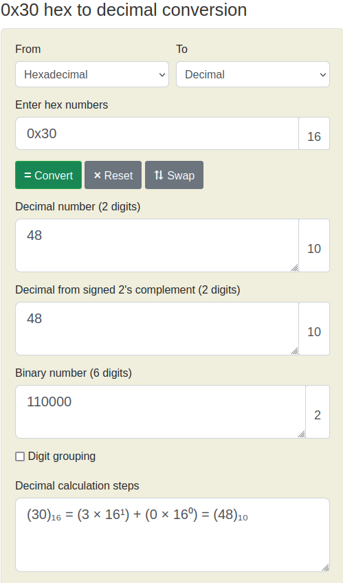

# Bit-O-Asm-1

We have a file with the below contents,

```asm
<+0>:     endbr64 
<+4>:     push   rbp
<+5>:     mov    rbp,rsp
<+8>:     mov    DWORD PTR [rbp-0x4],edi
<+11>:    mov    QWORD PTR [rbp-0x10],rsi
<+15>:    mov    eax,0x30
<+20>:    pop    rbp
<+21>:    ret
```

We want to know what is the value of `eax` at the end of this execution.

If we note the line <+15>,

```
<+15>:    mov    eax,0x30
```

We are moving `0x30` into `eax` here. If we convert `0x30` to decimal,



So `picoCTF{48}` is our answer.
