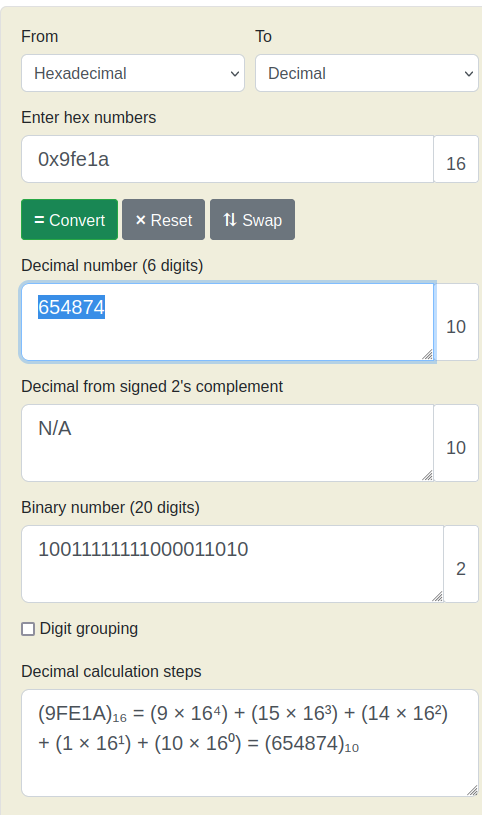

# Bit-O-Asm-2

Now we get the below file contents,

```asm
<+0>:     endbr64 
<+4>:     push   rbp
<+5>:     mov    rbp,rsp
<+8>:     mov    DWORD PTR [rbp-0x14],edi
<+11>:    mov    QWORD PTR [rbp-0x20],rsi
<+15>:    mov    DWORD PTR [rbp-0x4],0x9fe1a
<+22>:    mov    eax,DWORD PTR [rbp-0x4]
<+25>:    pop    rbp
<+26>:    ret
```

We want to find out the value of `eax` at the end of this execution.

If we note the below lines,

```asm
<+15>:    mov    DWORD PTR [rbp-0x4],0x9fe1a
<+22>:    mov    eax,DWORD PTR [rbp-0x4]
```

We see that we are moving `0x9fe1a` into `rbp-0x4`, and then moving `rbp-0x4` into `eax`.

If we convert `0x9fe1a` to decimal, we get the following output,



So `picoCTF{654874}` is our answer.
