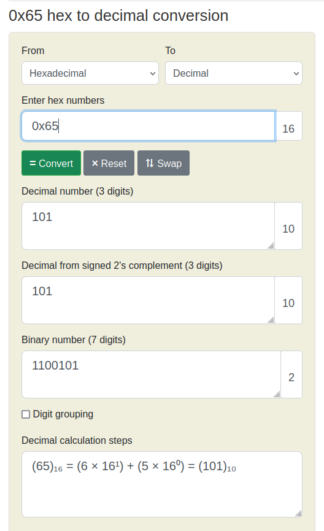
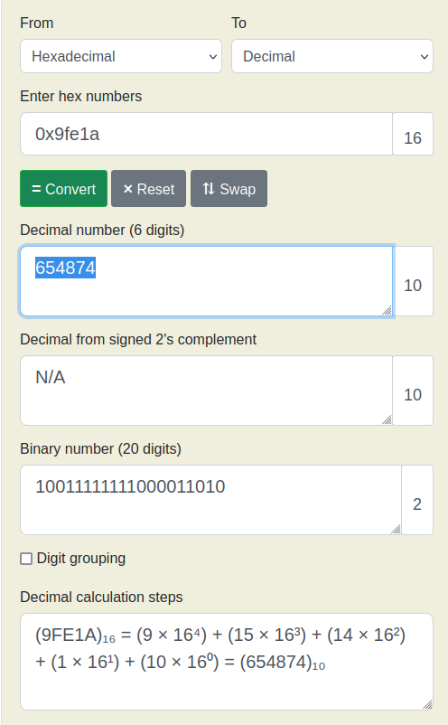
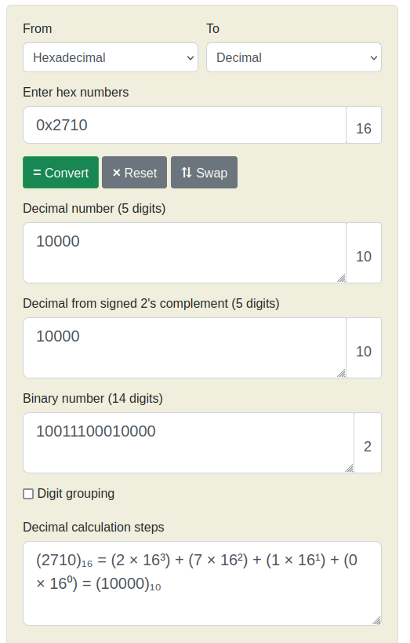

# Bit-O-Asm-4

We have the below file contents,

```
<+0>:     endbr64 
<+4>:     push   rbp
<+5>:     mov    rbp,rsp
<+8>:     mov    DWORD PTR [rbp-0x14],edi
<+11>:    mov    QWORD PTR [rbp-0x20],rsi
<+15>:    mov    DWORD PTR [rbp-0x4],0x9fe1a
<+22>:    cmp    DWORD PTR [rbp-0x4],0x2710
<+29>:    jle    0x55555555514e <main+37>
<+31>:    sub    DWORD PTR [rbp-0x4],0x65
<+35>:    jmp    0x555555555152 <main+41>
<+37>:    add    DWORD PTR [rbp-0x4],0x65
<+41>:    mov    eax,DWORD PTR [rbp-0x4]
<+44>:    pop    rbp
<+45>:    ret
```

We have to determine the value of `eax` at the end of this execution.

Using a reverse engineer approach, we can see the only and last mention of `eax` in the below line,

```asm
<+41>:    mov    eax,DWORD PTR [rbp-0x4]
```

We are moving the vlue of `rbp-0x4` into `eax`.

Previously, we added `0x65` to `rbp-0x4` at the below line,

```asm
<+37>:    add    DWORD PTR [rbp-0x4],0x65
```

Where `0x65` is `101` in decimal.



Let us reverse engineer for the above lines,

```asm
<+8>:     mov    DWORD PTR [rbp-0x14],edi
<+11>:    mov    QWORD PTR [rbp-0x20],rsi
<+15>:    mov    DWORD PTR [rbp-0x4],0x9fe1a
<+22>:    cmp    DWORD PTR [rbp-0x4],0x2710
<+29>:    jle    0x55555555514e <main+37>
<+31>:    sub    DWORD PTR [rbp-0x4],0x65
<+35>:    jmp    0x555555555152 <main+41>
```

`0x9fe1a` is `654874` in decimal, and `0x2710` is `10000` in decimal.





At line `<+22>` and `<+29>` we said the following,

```
<+22>:    cmp    DWORD PTR [rbp-0x4],0x2710
<+29>:    jle    0x55555555514e <main+37>
```

If we compare `654874` and `1000`, and check if `654874` is less than `1000`, we get false, so we will not be jumping here.

Instead we will go to the next line at `<+31>`,

```asm
<+31>:    sub    DWORD PTR [rbp-0x4],0x65
```

`rbp-0x4` has `654874` as decimal. We know `0x65` is `101`.

Thus,

```
rbp-0x4 = 654874 - 101
rbp-0x4 = 654773
```

We then jump to `<+41>`, where we are only moving `rbp-0x4` into `rax`, and so `eax` should be `654773`.

Hence, our answer is `picoCTF{654773}`.
