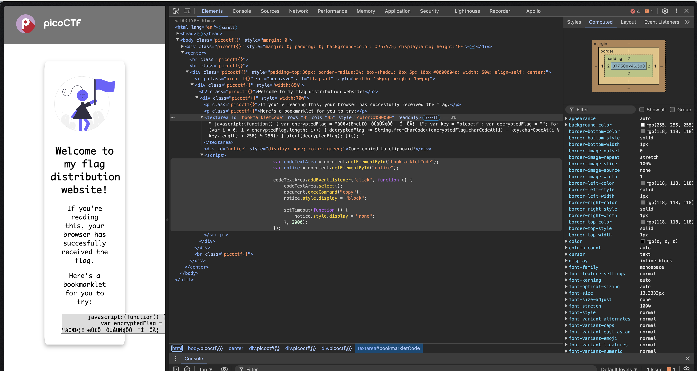
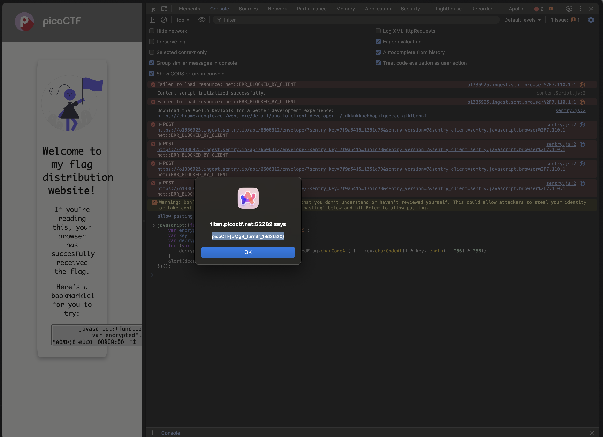

# Bookmarklet

## Description

Why search for the flag when I can make a bookmarklet to print it for me?
Browse [here](http://titan.picoctf.net:52289/), and find the flag!

## Solution

If we inspect the HTML,



We can see the JS that we need to execute,

```javascript
javascript:(function() {
    var encryptedFlag = "àÒÆަȬë٣֖ÓÚåÛÑ¢Õӗ¨Í•ÕĦ–í";
    var key = "picoctf";
    var decryptedFlag = "";
    for (var i = 0; i < encryptedFlag.length; i++) {
        decryptedFlag += String.fromCharCode((encryptedFlag.charCodeAt(i) - key.charCodeAt(i % key.length) + 256) % 256);
    }
    alert(decryptedFlag);
})();
```

We can execute this JS in the `Console` to get the flag,



The flag is `picoCTF{p@g3_turn3r_18d2fa20}`.
