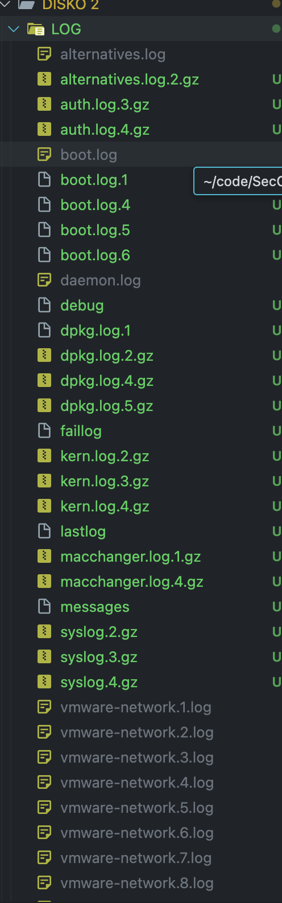
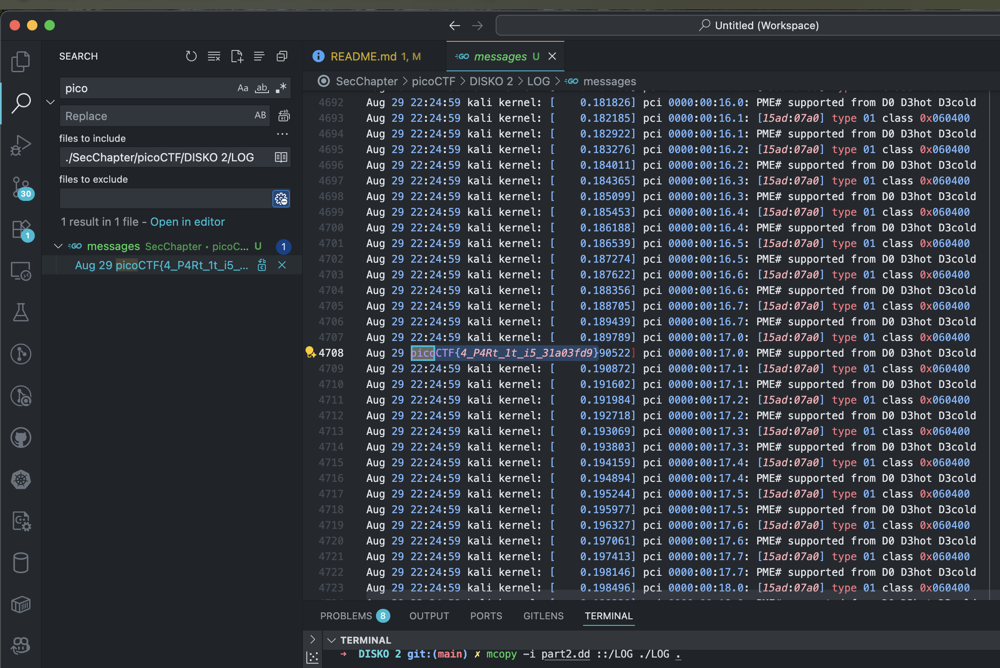
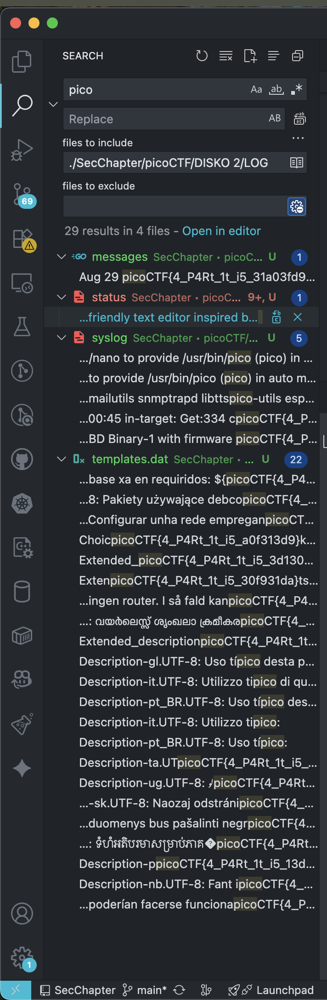

# DISKO 2

## Description

Can you find the flag in this disk image? The right one is Linux! One wrong step and its all gone!
Download the disk image [here](https://artifacts.picoctf.net/c/539/disko-2.dd.gz).

### Solution


```sh
# pre-req -- why/////// ----- we are on macos
brew install macfuse
brew install mtools
brew install e2fsprogs e2tools
# ---

curl https://artifacts.picoctf.net/c/539/disko-2.dd.gz -O
gunzip disko-2.dd.gz
strings disko-2.dd | grep "pico"
fdisk -d disko-2.dd 
# > 2048,51200,0x83,-,0,32,33,3,80,13
# > 53248,65536,0x0B,-,3,80,14,7,100,29
# > 0,0,0x00,-,0,0,0,0,0,0
# > 0,0,0x00,-,0,0,0,0,0,0

# Partition 1 (Linux ext4)
dd if=disko-2.dd of=part1.dd bs=512 skip=2048 count=51200
# > 51200+0 records in
# > 51200+0 records out
# > 26214400 bytes transferred in 0.106203 secs (246832952 bytes/sec)

# Partition 2 (FAT32)
dd if=disko-2.dd of=part2.dd bs=512 skip=53248 count=65536
# > 65536+0 records in
# > 65536+0 records out
# > 33554432 bytes transferred in 0.135409 secs (247800604 bytes/sec)
# Attach partition 1 (ext4 — needs ext4fuse for macOS)
hdiutil attach -imagekey diskimage-class=CRawDiskImage -nomount part1.dd
# > /dev/disk6
# Attach partition 2 (FAT32 — macOS can mount natively)
hdiutil attach -imagekey diskimage-class=CRawDiskImage -nomount part2.dd
# > /dev/disk7
diskutil list /dev/disk6
# > /dev/disk6 (disk image):
# >     #:                       TYPE NAME                    SIZE       IDENTIFIER
# >     0:                                                   +26.2 MB    disk6
diskutil list /dev/disk7                   
# > /dev/disk7 (disk image):
# >    #:                       TYPE NAME                    SIZE       IDENTIFIER
# >    0:                            NO NAME                +33.6 MB    disk7
mcopy -i part2.dd ::/LOG ./LOG . 
# > Attempt to copy file on itself
# > Attempt to copy file on itself
# > Attempt to copy file on itself
# > Attempt to copy file on itself
# > Attempt to copy file on itself
# > Attempt to copy file on itself
# > Attempt to copy file on itself
# > Attempt to copy file on itself
# > Attempt to copy file on itself
# > Attempt to copy file on itself
# > Attempt to copy file on itself
# > Attempt to copy file on itself
# > Attempt to copy file on itself
# > Attempt to copy file on itself
# > Attempt to copy file on itself
# > Attempt to copy file on itself
# > Attempt to copy file on itself
# > Attempt to copy file on itself
# > Attempt to copy file on itself
# > Attempt to copy file on itself
# > Attempt to copy file on itself
# > Attempt to copy file on itself
# > Attempt to copy file on itself
# > Attempt to copy file on itself
# > Attempt to copy file on itself
# > Attempt to copy file on itself
# > Attempt to copy file on itself
# > Attempt to copy file on itself
# > Attempt to copy file on itself
# > Attempt to copy file on itself
# > Attempt to copy file on itself
# > Attempt to copy file on itself
# > Attempt to copy file on itself
# > Attempt to copy file on itself
# > Attempt to copy file on itself
# > Attempt to copy file on itself
# > Attempt to copy file on itself
# > Attempt to copy file on itself
# > Attempt to copy file on itself
# > Attempt to copy file on itself
# > Attempt to copy file on itself
# > Attempt to copy file on itself
# > Attempt to copy file on itself
# > Attempt to copy file on itself
mcopy -i part2.dd -s "::LOG" .
strings part2.dd | grep pico | grep -v "picoCTF{4_P4Rt_1t_i5_903a13fd}" | grep -v "picoCTF{4_P4Rt_1t_i5_0d93a13f}" | grep -v "picoCTF{4_P4Rt_1t_i5_931afd03}" | grep -v "picoCTF{4_P4Rt_1t_i5_1daf9033" | grep -v "picoCTF{4_P4Rt_1t_i5_a1df3903}" | grep -v "picoCTF{4_P4Rt_1t_i5_39fa01d3}" | grep -v "picoCTF{4_P4Rt_1t_i5_f9331ad0}" | grep -v "picoCTF{4_P4Rt_1t_i5_af9d0133}" | grep -v "picoCTF{4_P4Rt_1t_i5_af91303d}" | grep -v "picoCTF{4_P4Rt_1t_i5_91fda330}" | grep -v "picoCTF{4_P4Rt_1t_i5_339d0fa1}" | grep -v "picoCTF{4_P4Rt_1t_i5_09a331df}" | grep -v "picoCTF{4_P4Rt_1t_i5_09a331df}" | grep -v "picoCTF{4_P4Rt_1t_i5_039fda13}" | grep -v "picoCTF{4_P4Rt_1t_i5_331d0f9a}" | grep -v "picoCTF{4_P4Rt_1t_i5_903d13af}" | grep -v "picoCTF{4_P4Rt_1t_i5_913a30df}" | grep -v "picoCTF{4_P4Rt_1t_i5_393da1f0}" | grep -v "picoCTF{4_P4Rt_1t_i5_1930da3f}" | grep -v "picoCTF{4_P4Rt_1t_i5_a0f313d9}" | grep -v "picoCTF{4_P4Rt_1t_i5_3d1309af}" | grep -v "picoCTF{4_P4Rt_1t_i5_30f931da}" | grep -v "picoCTF{4_P4Rt_1t_i5_1a33f09d}" | grep -v "picoCTF{4_P4Rt_1t_i5_339a10df}" | grep -v "picoCTF{4_P4Rt_1t_i5_0ad1393f}" | grep -v "picoCTF{4_P4Rt_1t_i5_13d093af}" | grep -v "picoCTF{4_P4Rt_1t_i5_310d39fa}" | grep -v "picoCTF{4_P4Rt_1t_i5_a031d9f3}" | grep -v "picoCTF{4_P4Rt_1t_i5_d3f1039a}" | grep -v "picoCTF{4_P4Rt_1t_i5_31a03fd9}" | grep -v "picoCTF{4_P4Rt_1t_i5_a9d0f313}" | grep -v "picoCTF{4_P4Rt_1t_i5_1f03d3a9}" | grep -v "picoCTF{4_P4Rt_1t_i5_9a013f3d}" | grep -v "picoCTF{4_P4Rt_1t_i5_f33d091a}" | grep -v "picoCTF{4_P4Rt_1t_i5_1d9fa303}" | grep -v "picoCTF{4_P4Rt_1t_i5_a3f9103d}" | grep -v "picoCTF{4_P4Rt_1t_i5_f19a03d3}" | grep -v "picoCTF{4_P4Rt_1t_i5_93fda130}" | grep -v "picoCTF{4_P4Rt_1t_i5_30df3a91}" | grep -v "picoCTF{4_P4Rt_1t_i5_09ad13f3}" | grep -v "picoCTF{4_P4Rt_1t_i5_a0913df3}" | grep -v "picoCTF{4_P4Rt_1t_i5_a0913df3}" | grep -v "picoCTF{4_P4Rt_1t_i5_913d03af}" | grep -v "picoCTF{4_P4Rt_1t_i5_f19d3a03}" | grep -v "picoCTF{4_P4Rt_1t_i5_f3019a3d}" | grep -v "picoCTF{4_P4Rt_1t_i5_309dfa13}" | grep -v "picoCTF{4_P4Rt_1t_i5_0a193f3d}" | grep -v "picoCTF{4_P4Rt_1t_i5_f9033d1a}" | grep -v "picoCTF{4_P4Rt_1t_i5_f3013da9}" | grep -v "picoCTF{4_P4Rt_1t_i5_33f0da91}" | grep -v "picoCTF{4_P4Rt_1t_i5_a1f033d9}" | grep -v "picoCTF{4_P4Rt_1t_i5_f3d0139a}" | grep pico
# it was in part1.dd all along!
grep -a -oE "picoCTF\{[^}]+\}" part1.dd | sort -u
# picoCTF{4_P4Rt_1t_i5_90a3f3d1}
```






