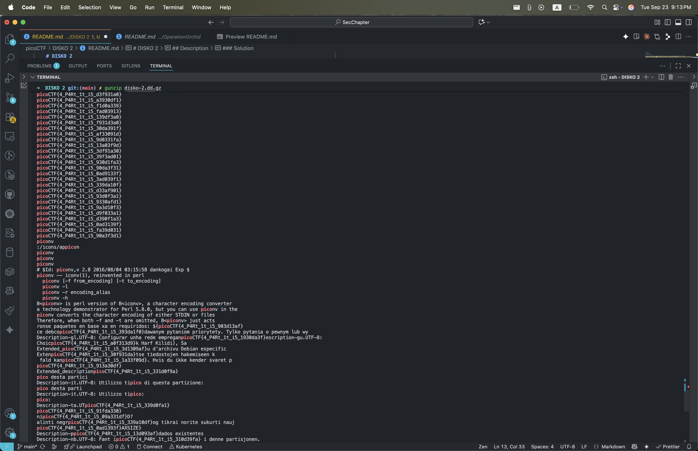

# DISKO 2

## Description

Can you find the flag in this disk image? The right one is Linux! One wrong step and its all gone!
Download the disk image [here](https://artifacts.picoctf.net/c/539/disko-2.dd.gz).

### Solution

```sh
curl https://artifacts.picoctf.net/c/539/disko-2.dd.gz -O
gunzip disko-2.dd.gz
strings disko-2.dd | grep "pico"
```


