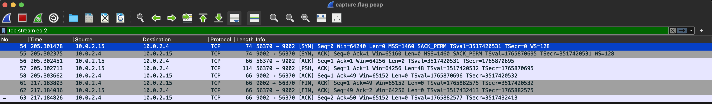
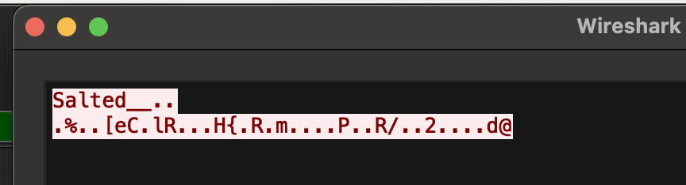
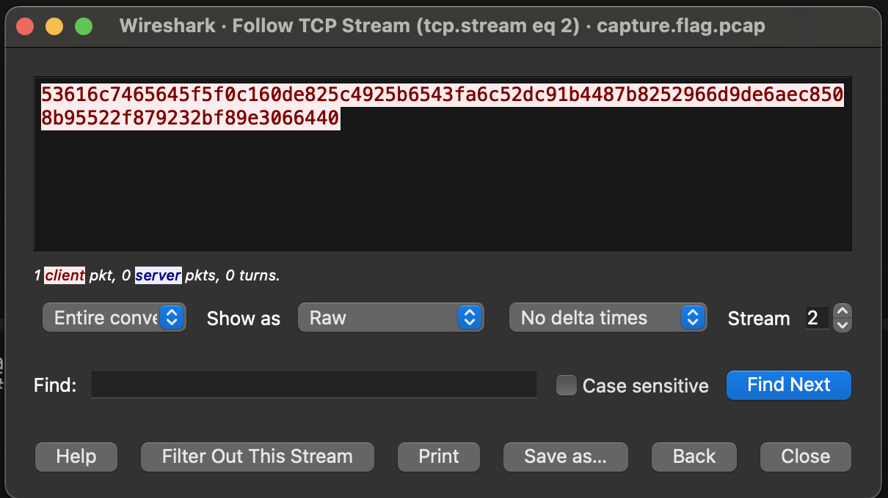

# Eavesdrop

## Description

Download this packet capture and find the flag.

- [Download packet capture](https://artifacts.picoctf.net/c/134/capture.flag.pcap)

## Solution

Download the file like so,

```sh
curl -O https://artifacts.picoctf.net/c/134/capture.flag.pcap
```

You should run `file` on the file to verify it is indeed a PCAP,

```sh
➜  Eavesdrop git:(main) ✗ file capture.flag.pcap 
capture.flag.pcap: pcap capture file, microsecond ts (little-endian) - version 2.4 (Ethernet, capture length 262144)
```

Run `strings` on the file to see details,

```sh
➜  Eavesdrop git:(main) ✗ strings -10 capture.flag.pcap 
focal-VirtualBox
EHey, how do you decrypt this file again?
ci>d@You're serious?
cYeah, I'm serious
*sigh* openssl des3 -d -salt -in file.des3 -out file.txt -k supersecretpassword123
Ok, great, thanks.
Let's use Discord next time, it's more secure.
NJC'mon, no one knows we use this program like this!
xWhatever.
gCould you transfer the file to me again?
GET / HTTP/1.1
Host: connectivity-check.ubuntu.com
Accept: */*
Connection: close
HTTP/1.1 204 No Content
Date: Mon, 04 Oct 2021 18:08:52 GMT
Server: Apache/2.4.18 (Ubuntu)
X-NetworkManager-Status: online
Connection: close
Oh great. Ok, over 9002?
Yeah, listening.
iA
  gSalted__

connectivity-check
connectivity-check
connectivity-check
connectivity-check
4iAa+You're unbelievable
```

Here is a slightly more cleaned up chat,

```text
Hey, how do you decrypt this file again?

You're serious?

Yeah, I'm serious

*sigh* openssl des3 -d -salt -in file.des3 -out file.txt -k supersecretpassword123

Ok, great, thanks.

Let's use Discord next time, it's more secure.

C'mon, no one knows we use this program like this!

Whatever.

Hey.

Yeah?

Could you transfer the file to me again?

Oh great. Ok, over 9002?

Yeah, listening.

Sent it

Got it.

You're unbelievable
```

We find the conversation mention the port `9002`, so we get a closer look on `Wirehshark`,



If we right click and then click on `Follow` -> `TCP Stream`, we get this output,



Strange, but let us store these contents in a file. Lets call that file `file.des3` as per the above conversation.

Please share the contents in a binary format, and NOT THE ASCII format using `Wireshark`,



Then run the below command,

```sh
openssl des3 -d -salt -in file.des3 -out file.txt -k supersecretpassword123
```

This will generate a file, `file.txt`, with the contents -> `picoCTF{nc_73115_411_dd54ab67}`.
