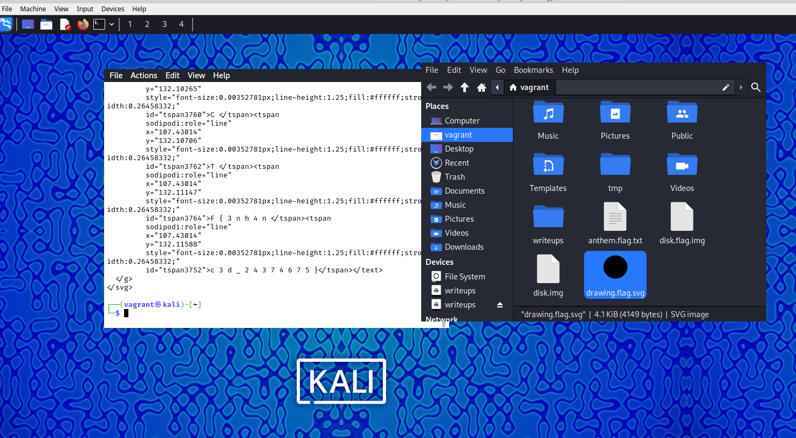

# Enhance!

## Description

Download this image file and find the flag.

- [Download image file](https://artifacts.picoctf.net/c/101/drawing.flag.svg)

## Solution

Download the SVG,

```sh
curl -O https://artifacts.picoctf.net/c/101/drawing.flag.svg
```

It is a very zoomed out PNG.



Luckily, we know that SVG is just XML, and we can run `cat` on this `SVG` which will give us an `XML` structure. We can see this in the above screenshot. We see some separated text. If we combine them, we get this -> `p i c o C T F { 3 n h 4 n c 3 d _ 2 4 3 7 4 6 7 5 }`

Removing the in-between spaces, we get -> `picoCTF{3nh4nc3d_24374675}`, which is the required flag.
