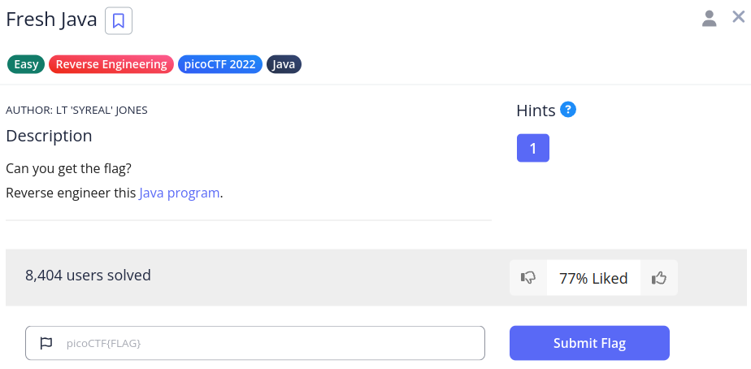

# Fresh Java

We have this challenge,



We get this file, `KeygenMe.class` from the link.

If we run it, we get the below output,

```sh
(env) saif@saif:~/code/SecChapter/picoCTF/Fresh Java$ java KeygenMe 
Enter key:
1
Invalid key
```

If we decode the `class` file, we get this output,

```java
// Source code is decompiled from a .class file using FernFlower decompiler.
import java.util.Scanner;

public class KeygenMe {
   public KeygenMe() {
   }

   public static void main(String[] var0) {
      Scanner var1 = new Scanner(System.in);
      System.out.println("Enter key:");
      String var2 = var1.nextLine();
      if (var2.length() != 34) {
         System.out.println("Invalid key");
      } else if (var2.charAt(33) != '}') {
         System.out.println("Invalid key");
      } else if (var2.charAt(32) != 'd') {
         System.out.println("Invalid key");
      } else if (var2.charAt(31) != '0') {
         System.out.println("Invalid key");
      } else if (var2.charAt(30) != 'a') {
         System.out.println("Invalid key");
      } else if (var2.charAt(29) != '1') {
         System.out.println("Invalid key");
      } else if (var2.charAt(28) != 'e') {
         System.out.println("Invalid key");
      } else if (var2.charAt(27) != 'f') {
         System.out.println("Invalid key");
      } else if (var2.charAt(26) != 'b') {
         System.out.println("Invalid key");
      } else if (var2.charAt(25) != '2') {
         System.out.println("Invalid key");
      } else if (var2.charAt(24) != '_') {
         System.out.println("Invalid key");
      } else if (var2.charAt(23) != 'd') {
         System.out.println("Invalid key");
      } else if (var2.charAt(22) != '3') {
         System.out.println("Invalid key");
      } else if (var2.charAt(21) != 'r') {
         System.out.println("Invalid key");
      } else if (var2.charAt(20) != '1') {
         System.out.println("Invalid key");
      } else if (var2.charAt(19) != 'u') {
         System.out.println("Invalid key");
      } else if (var2.charAt(18) != 'q') {
         System.out.println("Invalid key");
      } else if (var2.charAt(17) != '3') {
         System.out.println("Invalid key");
      } else if (var2.charAt(16) != 'r') {
         System.out.println("Invalid key");
      } else if (var2.charAt(15) != '_') {
         System.out.println("Invalid key");
      } else if (var2.charAt(14) != 'g') {
         System.out.println("Invalid key");
      } else if (var2.charAt(13) != 'n') {
         System.out.println("Invalid key");
      } else if (var2.charAt(12) != '1') {
         System.out.println("Invalid key");
      } else if (var2.charAt(11) != 'l') {
         System.out.println("Invalid key");
      } else if (var2.charAt(10) != '0') {
         System.out.println("Invalid key");
      } else if (var2.charAt(9) != '0') {
         System.out.println("Invalid key");
      } else if (var2.charAt(8) != '7') {
         System.out.println("Invalid key");
      } else if (var2.charAt(7) != '{') {
         System.out.println("Invalid key");
      } else if (var2.charAt(6) != 'F') {
         System.out.println("Invalid key");
      } else if (var2.charAt(5) != 'T') {
         System.out.println("Invalid key");
      } else if (var2.charAt(4) != 'C') {
         System.out.println("Invalid key");
      } else if (var2.charAt(3) != 'o') {
         System.out.println("Invalid key");
      } else if (var2.charAt(2) != 'c') {
         System.out.println("Invalid key");
      } else if (var2.charAt(1) != 'i') {
         System.out.println("Invalid key");
      } else if (var2.charAt(0) != 'p') {
         System.out.println("Invalid key");
      } else {
         System.out.println("Valid key");
      }
   }
}
```

If we connect the characters together, we get the following -> `picoCTF{700l1ng_r3qu1r3d_2bfe1a0d}`, which is the answer.
