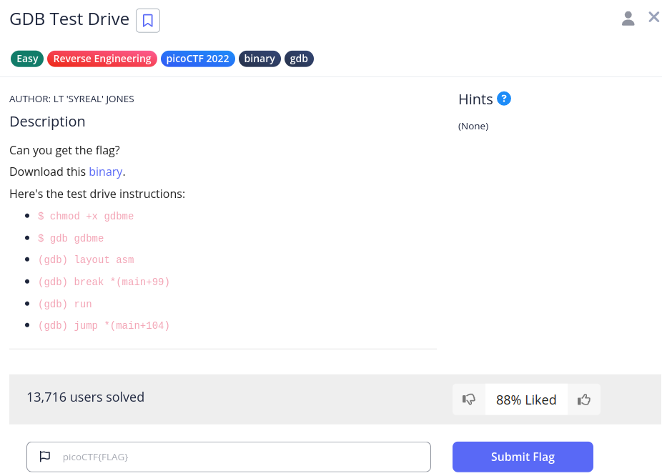

# GDB Test Drive

So we have this challenge,



The steps are,

```
$ chmod +x gdbme
$ gdb gdbme
(gdb) layout asm
(gdb) break *(main+99)
(gdb) run
(gdb) jump *(main+104)
```

// TODO, python setup broke
