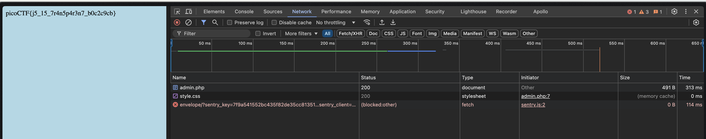

# Local Authority

## Description

Can you get the flag?
Go to this [website](http://saturn.picoctf.net:55817/) and see what you can discover.

> Note: This challenge requires launching an instance

## Solution

If you provide any credentials to the login page and wait to see output on the `Network` tab after clicking on `login`, we can see this file,

So the username is `admin` and the password is `strongPassword098765`.

If we login again with these credentials, we get the flag,

The flag is `picoCTF{j5_15_7r4n5p4r3n7_b0c2c9cb}`.
