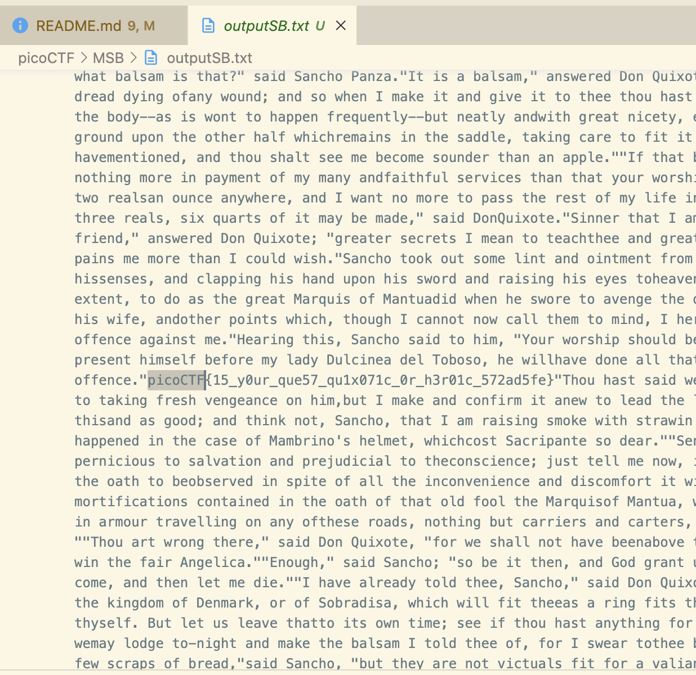

# MSB

## Table Of Contents

- [MSB](#msb)
  - [Table Of Contents](#table-of-contents)
  - [Description](#description)
  - [Analysis](#analysis)
    - [xxd](#xxd)
    - [pngcheck](#pngcheck)
    - [exiftool](#exiftool)
    - [identify](#identify)
    - [binwalk](#binwalk)
    - [foremost](#foremost)
  - [Solution](#solution)
  - [NOTE](#note)

## Description

This image passes LSB statistical analysis, but we can't help but think there must be something to the visual artifacts present in this image...
Download the image [here](https://artifacts.picoctf.net/c/305/Ninja-and-Prince-Genji-Ukiyoe-Utagawa-Kunisada.flag.png).

## Analysis

### xxd

```sh
➜  MSB git:(main) ✗ xxd Ninja-and-Prince-Genji-Ukiyoe-Utagawa-Kunisada.flag.png | head
00000000: 8950 4e47 0d0a 1a0a 0000 000d 4948 4452  .PNG........IHDR
00000010: 0000 0432 0000 05dc 0802 0000 005f f239  ...2........._.9
00000020: 3100 0100 0049 4441 5478 9c9c fdd9 9624  1....IDATx.....$
00000030: 3976 2008 5e00 22aa 66e6 114c d6d2 d57d  9v .^.".f..L...}
00000040: ce7c c57c c84c 378b 6c9e 4a32 63f7 7077  .|.|.L7.l.J2c.pw
00000050: 3377 db75 9505 b880 88aa 9979 4426 a7ba  3w.u.......yD&..
00000060: 6a1e a6e7 653e a79f bac9 2e92 c564 666c  j...e>.......dfl
00000070: beda bee8 ae22 0260 1e20 22aa 1e99 5553  .....".`. "...US
00000080: 67cc cdd5 5445 4580 8b7b 2f80 bb83 3cbd  g...TEE..{/...<.
00000090: df47 4404 4404 4040 4004 0440 0400 4080  .GD.D.@@@..@..@.
```

### pngcheck

```sh
➜  MSB git:(main) ✗ pngcheck -v Ninja-and-Prince-Genji-Ukiyoe-Utagawa-Kunisada.flag.png 
File: Ninja-and-Prince-Genji-Ukiyoe-Utagawa-Kunisada.flag.png (3354311 bytes)
  chunk IHDR at offset 0x0000c, length 13
    1074 x 1500 image, 24-bit RGB, non-interlaced
  chunk IDAT at offset 0x00025, length 65536
    zlib: deflated, 32K window, default compression
  chunk IDAT at offset 0x10031, length 65536
  chunk IDAT at offset 0x2003d, length 65536
  chunk IDAT at offset 0x30049, length 65536
  chunk IDAT at offset 0x40055, length 65536
  chunk IDAT at offset 0x50061, length 65536
  chunk IDAT at offset 0x6006d, length 65536
  chunk IDAT at offset 0x70079, length 65536
  chunk IDAT at offset 0x80085, length 65536
  chunk IDAT at offset 0x90091, length 65536
  chunk IDAT at offset 0xa009d, length 65536
  chunk IDAT at offset 0xb00a9, length 65536
  chunk IDAT at offset 0xc00b5, length 65536
  chunk IDAT at offset 0xd00c1, length 65536
  chunk IDAT at offset 0xe00cd, length 65536
  chunk IDAT at offset 0xf00d9, length 65536
  chunk IDAT at offset 0x1000e5, length 65536
  chunk IDAT at offset 0x1100f1, length 65536
  chunk IDAT at offset 0x1200fd, length 65536
  chunk IDAT at offset 0x130109, length 65536
  chunk IDAT at offset 0x140115, length 65536
  chunk IDAT at offset 0x150121, length 65536
  chunk IDAT at offset 0x16012d, length 65536
  chunk IDAT at offset 0x170139, length 65536
  chunk IDAT at offset 0x180145, length 65536
  chunk IDAT at offset 0x190151, length 65536
  chunk IDAT at offset 0x1a015d, length 65536
  chunk IDAT at offset 0x1b0169, length 65536
  chunk IDAT at offset 0x1c0175, length 65536
  chunk IDAT at offset 0x1d0181, length 65536
  chunk IDAT at offset 0x1e018d, length 65536
  chunk IDAT at offset 0x1f0199, length 65536
  chunk IDAT at offset 0x2001a5, length 65536
  chunk IDAT at offset 0x2101b1, length 65536
  chunk IDAT at offset 0x2201bd, length 65536
  chunk IDAT at offset 0x2301c9, length 65536
  chunk IDAT at offset 0x2401d5, length 65536
  chunk IDAT at offset 0x2501e1, length 65536
  chunk IDAT at offset 0x2601ed, length 65536
  chunk IDAT at offset 0x2701f9, length 65536
  chunk IDAT at offset 0x280205, length 65536
  chunk IDAT at offset 0x290211, length 65536
  chunk IDAT at offset 0x2a021d, length 65536
  chunk IDAT at offset 0x2b0229, length 65536
  chunk IDAT at offset 0x2c0235, length 65536
  chunk IDAT at offset 0x2d0241, length 65536
  chunk IDAT at offset 0x2e024d, length 65536
  chunk IDAT at offset 0x2f0259, length 65536
  chunk IDAT at offset 0x300265, length 65536
  chunk IDAT at offset 0x310271, length 65536
  chunk IDAT at offset 0x32027d, length 65536
  chunk IDAT at offset 0x330289, length 11306
  chunk IEND at offset 0x332ebf, length 0
No errors detected in Ninja-and-Prince-Genji-Ukiyoe-Utagawa-Kunisada.flag.png (54 chunks, 30.6% compression).
```

### exiftool

```sh
➜  MSB git:(main) ✗ exiftool Ninja-and-Prince-Genji-Ukiyoe-Utagawa-Kunisada.flag.png 
ExifTool Version Number         : 13.00
File Name                       : Ninja-and-Prince-Genji-Ukiyoe-Utagawa-Kunisada.flag.png
Directory                       : .
File Size                       : 3.4 MB
File Modification Date/Time     : 2024:12:13 23:31:23+05:00
File Access Date/Time           : 2024:12:13 23:33:04+05:00
File Inode Change Date/Time     : 2024:12:13 23:33:06+05:00
File Permissions                : -rw-r--r--
File Type                       : PNG
File Type Extension             : png
MIME Type                       : image/png
Image Width                     : 1074
Image Height                    : 1500
Bit Depth                       : 8
Color Type                      : RGB
Compression                     : Deflate/Inflate
Filter                          : Adaptive
Interlace                       : Noninterlaced
Image Size                      : 1074x1500
Megapixels                      : 1.6
```

### identify

```sh
➜  MSB git:(main) ✗ identify -verbose Ninja-and-Prince-Genji-Ukiyoe-Utagawa-Kunisada.flag.png
Image:
  Filename: Ninja-and-Prince-Genji-Ukiyoe-Utagawa-Kunisada.flag.png
  Permissions: rw-r--r--
  Format: PNG (Portable Network Graphics)
  Mime type: image/png
  Class: DirectClass
  Geometry: 1074x1500+0+0
  Units: Undefined
  Colorspace: sRGB
  Type: TrueColor
  Endianness: Undefined
  Depth: 8-bit
  Channels: 3.0
  Channel depth:
    Red: 8-bit
    Green: 8-bit
    Blue: 8-bit
  Channel statistics:
    Pixels: 1611000
    Red:
      min: 0  (0)
      max: 255 (1)
      mean: 122.8 (0.481568)
      median: 113 (0.443137)
      standard deviation: 67.9966 (0.266653)
      kurtosis: -1.06012
      skewness: 0.18922
      entropy: 0.985985
    Green:
      min: 0  (0)
      max: 255 (1)
      mean: 116.776 (0.457946)
      median: 123 (0.482353)
      standard deviation: 68.2511 (0.267651)
      kurtosis: -1.20468
      skewness: 0.103903
      entropy: 0.972572
    Blue:
      min: 0  (0)
      max: 255 (1)
      mean: 107.555 (0.421783)
      median: 118 (0.462745)
      standard deviation: 68.7159 (0.269474)
      kurtosis: -1.1001
      skewness: 0.197045
      entropy: 0.967217
  Image statistics:
    Overall:
      min: 0  (0)
      max: 255 (1)
      mean: 115.71 (0.453766)
      median: 118 (0.462745)
      standard deviation: 68.3212 (0.267926)
      kurtosis: -1.12163
      skewness: 0.163389
      entropy: 0.975258
  Rendering intent: Perceptual
  Gamma: 0.454545
  Chromaticity:
    red primary: (0.64,0.33,0.03)
    green primary: (0.3,0.6,0.1)
    blue primary: (0.15,0.06,0.79)
    white point: (0.3127,0.329,0.3583)
  Matte color: grey74
  Background color: white
  Border color: srgb(223,223,223)
  Transparent color: black
  Interlace: None
  Intensity: Undefined
  Compose: Over
  Page geometry: 1074x1500+0+0
  Dispose: Undefined
  Iterations: 0
  Compression: Zip
  Orientation: Undefined
  Properties:
    date:create: 2024-12-13T18:33:06+00:00
    date:modify: 2024-12-13T18:31:23+00:00
    date:timestamp: 2024-12-13T18:40:53+00:00
    png:IHDR.bit-depth-orig: 8
    png:IHDR.bit_depth: 8
    png:IHDR.color-type-orig: 2
    png:IHDR.color_type: 2 (Truecolor)
    png:IHDR.interlace_method: 0 (Not interlaced)
    png:IHDR.width,height: 1074, 1500
    signature: d24f1a6cf67ab65e6fab9ff92fca669ddd5154015417631cb45df4af36e9e2ac
  Artifacts:
    verbose: true
  Tainted: False
  Filesize: 3.19892MiB
  Number pixels: 1.611M
  Pixel cache type: Memory
  Pixels per second: 48.7213MP
  User time: 0.020u
  Elapsed time: 0:01.033
  Version: ImageMagick 7.1.1-41 Q16-HDRI aarch64 22504 https://imagemagick.org
```

### binwalk

```sh
➜  MSB git:(main) ✗ binwalk Ninja-and-Prince-Genji-Ukiyoe-Utagawa-Kunisada.flag.png 

                                                 /Users/saif.islam/code/SecChapter/picoCTF/MSB/Ninja-and-Prince-Genji-Ukiyoe-Utagawa-Kunisada.flag.png
------------------------------------------------------------------------------------------------------------------------------------------------------------------------------------------------------
DECIMAL                            HEXADECIMAL                        DESCRIPTION
------------------------------------------------------------------------------------------------------------------------------------------------------------------------------------------------------
0                                  0x0                                PNG image, total size: 3354311 bytes
------------------------------------------------------------------------------------------------------------------------------------------------------------------------------------------------------

Analyzed 1 file for 85 file signatures (187 magic patterns) in 7.0 milliseconds
```

### foremost

Output attached in directory,

```sh
Foremost version 1.5.7 by Jesse Kornblum, Kris Kendall, and Nick Mikus
Audit File

Foremost started at Fri Dec 13 23:36:53 2024
Invocation: foremost -t all -i Ninja-and-Prince-Genji-Ukiyoe-Utagawa-Kunisada.flag.png -o output_dir 
Output directory: /Users/saif.islam/code/SecChapter/picoCTF/MSB/output_dir
Configuration file: /opt/homebrew/etc/foremost.conf
------------------------------------------------------------------
File: Ninja-and-Prince-Genji-Ukiyoe-Utagawa-Kunisada.flag.png
Start: Fri Dec 13 23:36:53 2024
Length: Unknown
 
Num	 Name (bs=512)	       Size	 File Offset	 Comment 

0:	00000000.png 	       3 MB 	          0 	  (1074 x 1500)
Finish: Fri Dec 13 23:36:53 2024

1 FILES EXTRACTED
	
png:= 1
------------------------------------------------------------------

Foremost finished at Fri Dec 13 23:36:53 2024
```

## Solution

I got caught up trying to understand how forensic analysis for PNG files is done. After spending 1.5 hours on this problem, I decided to GitHub this CTF, and found this [solution](https://github.com/snwau/picoCTF-2023-Writeup/blob/main/Forensics/MSB/MSB.md).

To replicate the steps, we do the following -- we download a Python script to extract the MSB (Most Significant Bits)/LSB (Least Significant Bits) for the PNG file,

```sh
python3 -m venv env
echo "env/**/**" > .gitignore
source env/bin/activate
pip3 install Pillow
wget https://raw.githubusercontent.com/Pulho/sigBits/master/sigBits.py
```

And then we execute the script,

```sh
python3 sigBits.py -t=msb Ninja-and-Prince-Genji-Ukiyoe-Utagawa-Kunisada.flag.png 
```

This generates an output file -> `outputSB.txt`. We can search for the flag here, as shown in the screenshot,



The flag is thus, `picoCTF{15_y0ur_que57_qu1x071c_0r_h3r01c_572ad5fe}`.

## NOTE

PS -- it would be a great idea to read the script in detail to understand how this was accomplshed!
