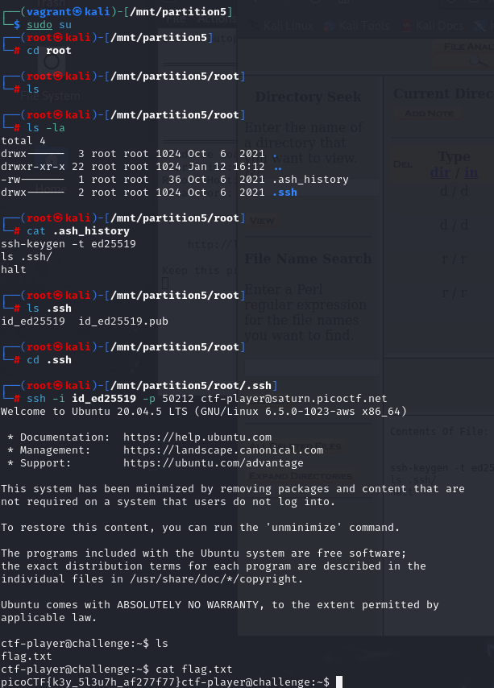
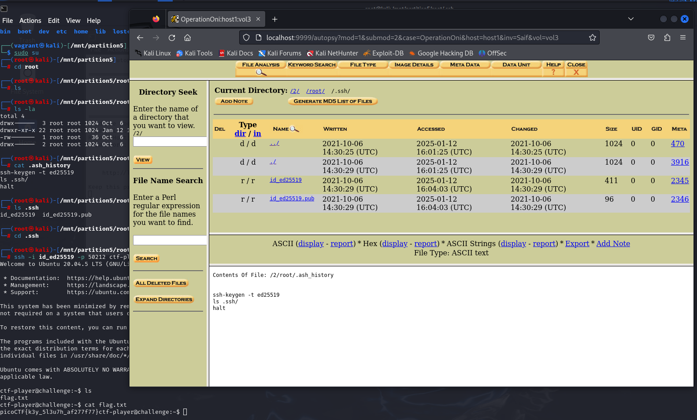

# Operation Oni

## Description

> Note: you must launch a challenge instance in order to view your disk image download link.

Download this disk image, find the key and log into the remote machine. Note: if you are using the webshell, download and extract the disk image into /tmp not your home directory.

Additional details will be available after launching your challenge instance.

- [Download disk image](https://artifacts.picoctf.net/c/71/disk.img.gz)
- Remote machine: `ssh -i key_file -p 49172 ctf-player@saturn.picoctf.net`

## Solution

cURL the disk image,

```sh
curl -O https://artifacts.picoctf.net/c/71/disk.img.gz
```

As an investigator, you will be not surprised to see a common flow to this as you can notice in "Operation Orchid". You need to mount the partition (2nd), and visit the `root` directory,



You can also fire up `autopsy` and open the partition like that, and find this directory as well,



Anyhow, the flag is `picoCTF{k3y_5l3u7h_af277f77}`.
