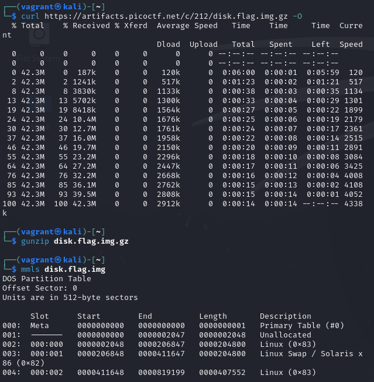
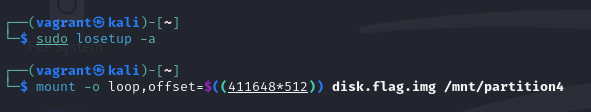
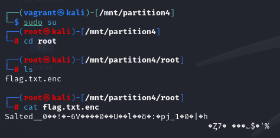
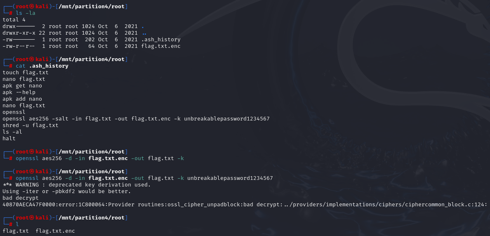
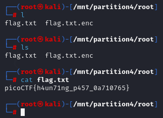

# Operation Orchid

## Description

Download this disk image and find the flag. Note: if you are using the webshell, download and extract the disk image into /tmp not your home directory.

- [Download compressed disk image](https://artifacts.picoctf.net/c/212/disk.flag.img.gz)

## Solution

Get the image,

```sh
curl https://artifacts.picoctf.net/c/212/disk.flag.img.gz
```



Mount the image. Use `sudo` if needed,



Need to go into the mount path, and use `sudo` to find the flag file,



Notice that the directory contains an `ash` history. Read it to find the command used to encode the file,



Now, we have our flag,



So the flag is `picoCTF{h4un71ng_p457_0a710765}`.
