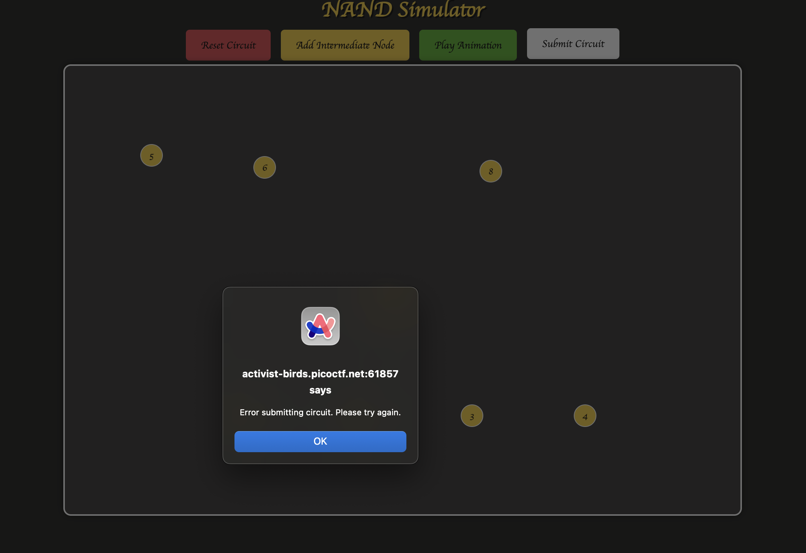

# Pachinko

History has failed us, but no matter.
[Server source](https://challenge-files.picoctf.net/c_activist_birds/7eac27979c12e4bd449f03e40a8492044221b7d2a96ac85f1150e30983c56eac/server.tar.gz)
There are two flags in this challenge. Submit flag one here, and flag two in Pachinko Revisited.
[Website](http://activist-birds.picoctf.net:61857/)

## Solution

```sh
curl https://challenge-files.picoctf.net/c_activist_birds/7eac27979c12e4bd449f03e40a8492044221b7d2a96ac85f1150e30983c56eac/server.tar.gz -O
gunzip server.tar.gz
tar -xvf server.tar
cd server
cd programs
strings flag.bin 
grep -a -oE "pico" flag.bin 
cat flag.bin  # soce-i.=o%  
```

...


