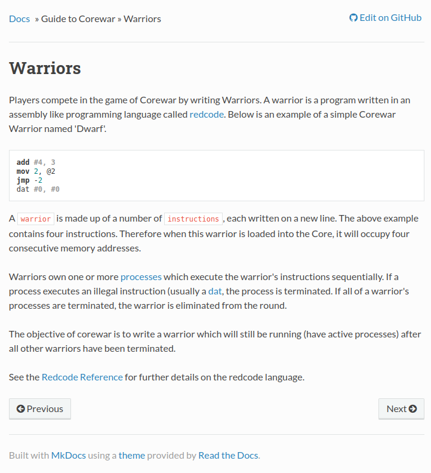

# Ready Gladiator 1

`CoreWars` is an actual game!

If you use the hint, it will mention something about finding a warrior.

If you google search for `warrior corewars`, you can find a page similar to this, https://corewar-docs.readthedocs.io/en/latest/corewar/warriors/.



If we can change the file to the below,

```
;redcode
;name Warrior Ex
;assert 2
add #4, 3
mov 2, @2
jmp -2
dat #0, #0
end
```

and then pass it to the instance like this,

```sh
nc saturn.picoctf.net 64395 < imp.red
```

And we get our flag!

```text
(env) saif@saif:~/code/SecChapter/picoCTF/Ready Gladiator 1$ nc saturn.picoctf.net 64395 < imp.red 
;redcode
;name Warrior Ex
;assert 2
add #4, 3
mov 2, @2
jmp -2
dat #0, #0
end
Submit your warrior: (enter 'end' when done)

Warrior1:
;redcode
;name Warrior Ex
;assert 2
add #4, 3
mov 2, @2
jmp -2
dat #0, #0
end

Rounds: 100
Warrior 1 wins: 19
Warrior 2 wins: 0
Ties: 81
You did it!
picoCTF{1mp_1n_7h3_cr055h41r5_b9bb3269}
```
