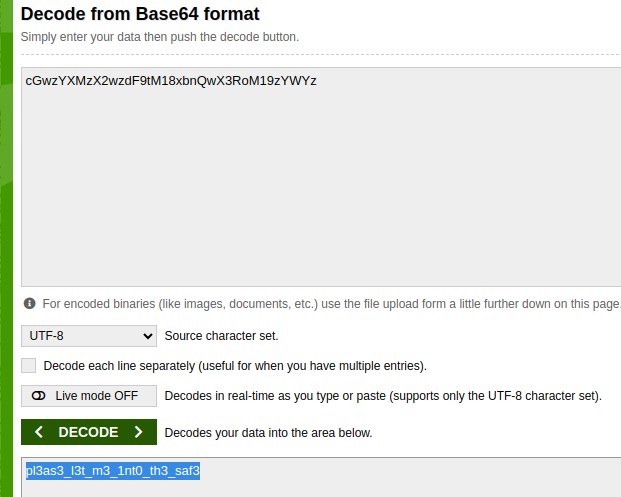

# Safe Opener

Just take the string and decode it, since it is Base64. We will decode it to UTF8,

```java
    public static boolean openSafe(String password) {
        String encodedkey = "cGwzYXMzX2wzdF9tM18xbnQwX3RoM19zYWYz";
        
        if (password.equals(encodedkey)) {
            System.out.println("Sesame open");
            return true;
        }
        else {
            System.out.println("Password is incorrect\n");
            return false;
        }
    }
```

If we decode it, we get `pl3as3_l3t_m3_1nt0_th3_saf3a`,



So `picoCTF{pl3as3_l3t_m3_1nt0_th3_saf3a}` is the answer.
