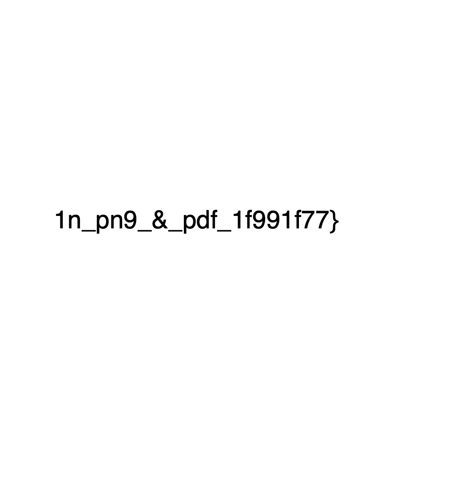
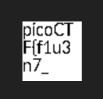

# Secret Of The Polyglot

## Description

The Network Operations Center (NOC) of your local institution picked up a suspicious file, they're getting conflicting information on what type of file it is. They've brought you in as an external expert to examine the file. Can you extract all the information from this strange file?

Download the suspicious file [here](https://artifacts.picoctf.net/c_titan/98/flag2of2-final.pdf).

## Solution

If you open the link, you can download a named "Flag 2 of 2.pdf". If you open the PDF, you can find this text at the bottom of the page,



The text here is `1n_pn9_&_pdf_1f991f77}`.

However, strangely, but amazingly, if you run the `file` command on the file. it will tell you something else,

```sh
➜  Secret Of The Polyglot git:(main) ✗ file Flag\ 2\ of\ 2\ Final.pdf 
Flag 2 of 2 Final.pdf: PNG image data, 50 x 50, 8-bit/color RGBA, non-interlaced
```

So the `.pdf` is actually ... not a PDF? It is actually a .png. If we rename this file to be a png, we see the other part of the flag,



This is the first half of the flag, which is `picoCTF{f1u3n7_`.

If we combine the two texts, we get the following,

```text
picoCTF{f1u3n7_1n_pn9_&_pdf_1f991f77}
```

Which is the required flag.
