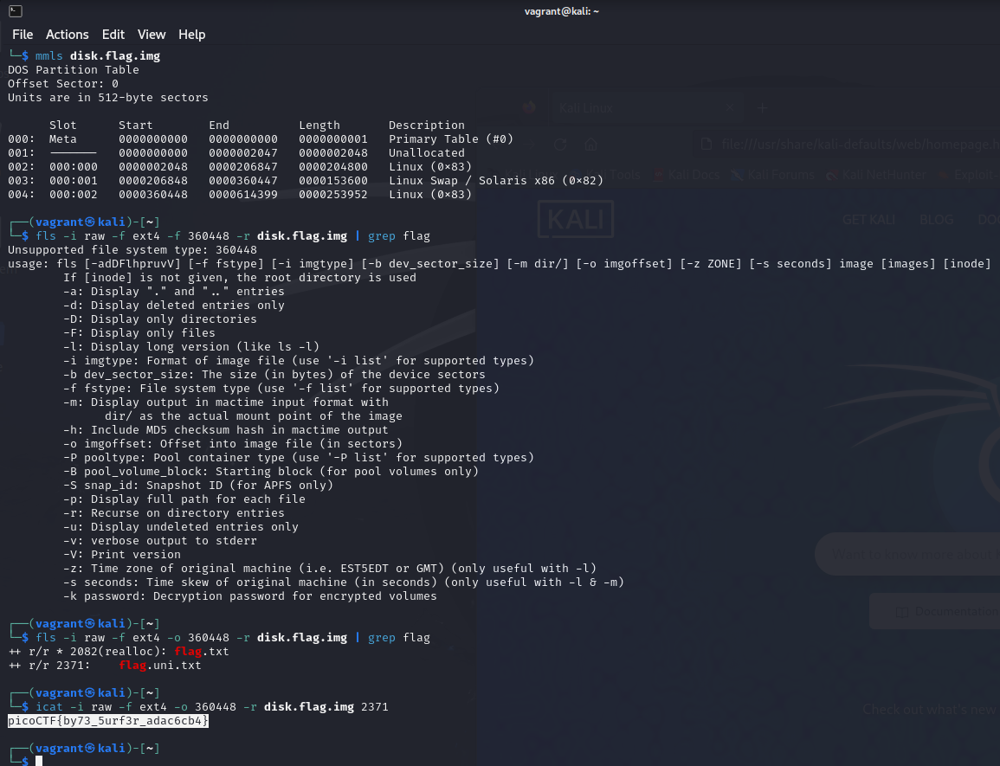

# Sleuthkit Apprentice

## Description

Download this disk image and find the flag. Note: if you are using the webshell, download and extract the disk image into /tmp not your home directory.

[Download compressed disk image](https://artifacts.picoctf.net/c/137/disk.flag.img.gz)

## Solution

Need to use `fsstat` and `icat` to extract the flag,

So the flag is `picoCTF{by73_5urf3r_adac6cb4}`.
