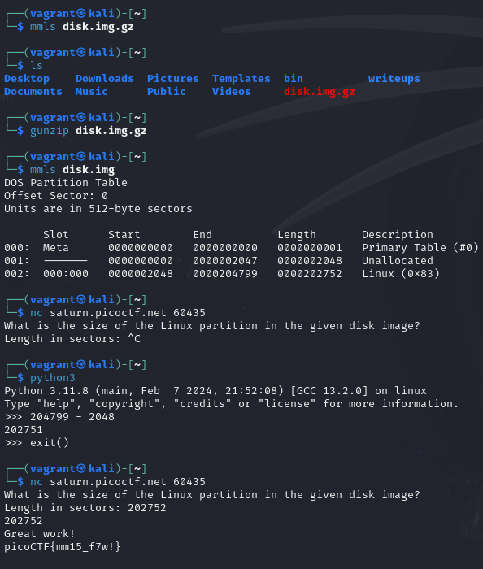

# Sleuthkit Intro

## Description

Download the disk image and use `mmls` on it to find the size of the Linux partition. Connect to the remote checker service to check your answer and get the flag. 

> Note: if you are using the webshell, download and extract the disk image into /tmp not your home directory.

[Download disk image](https://artifacts.picoctf.net/c/164/disk.img.gz)

Access checker program: `nc saturn.picoctf.net 60435`

## Solution

Pretty simple. Use `gunzip` on the downloaded file and run `mmls` and see value for the `Linux` partition for the column `length,

So the flag is `picoCTF{mm15_f7w!}`.
