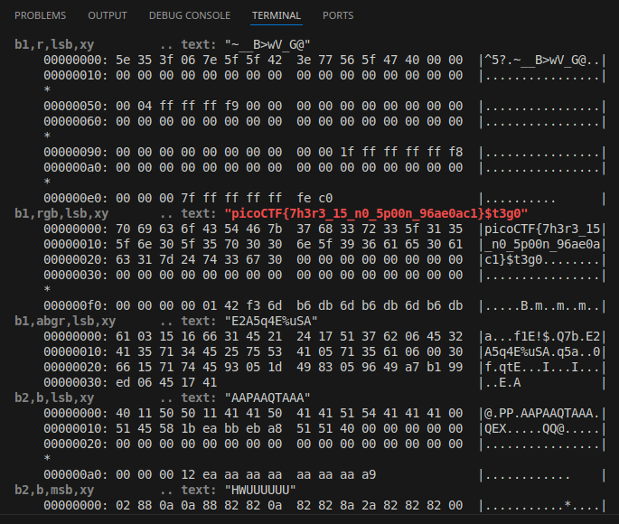

# St3go

## Description

Download this image and find the flag.

- [Download image](https://artifacts.picoctf.net/c/215/pico.flag.png)


## Solution

Download the file with `cURL`,

```sh
curl -O https://artifacts.picoctf.net/c/215/pico.flag.png
```

I initially spent a lot of time trying to understand if this is something I could solve with `stegosolver`, as the name "implied", but I was wrong.

The solution for this is through using `zsteg` on the file,

```sh
zsteg -a -v pico.flag.png
```

At `b1,rgb,lsb,xy`, we can see the flag,



So the flag is "picoCTF{7h3r3_15_n0_5p00n_96ae0ac1}".
