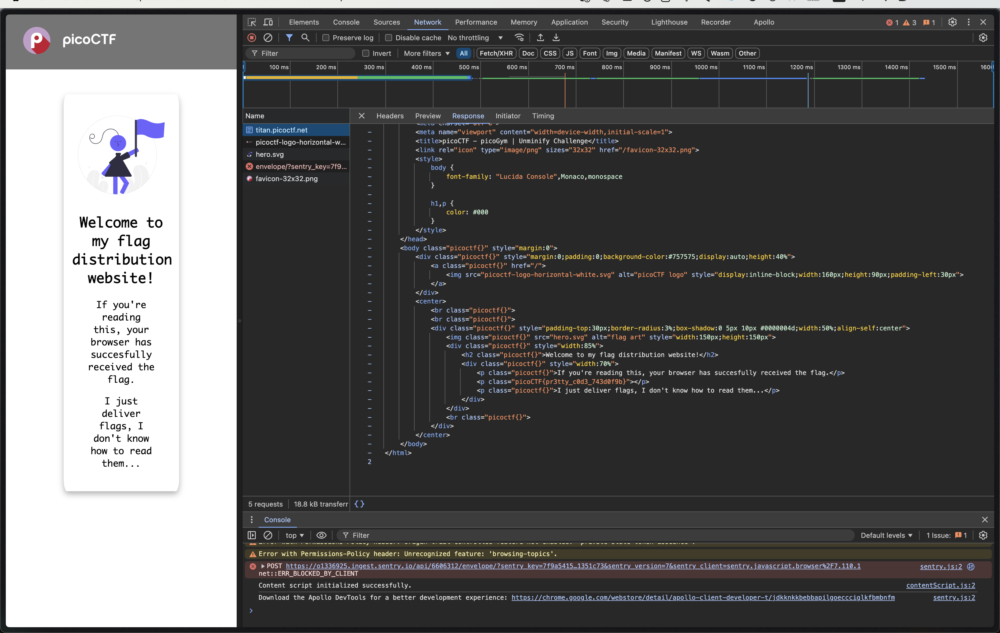

# Unminify

## Description

I don't like scrolling down to read the code of my website, so I've squished it. As a bonus, my pages load faster!
Browse [here](http://titan.picoctf.net:54481/), and find the flag!

> NOTE: You need to launch an instance for this

## Solution

For this, just inspect the `Network` tab,

The flag is `picoCTF{pr3tty_c0d3_743d0f9b}`.
