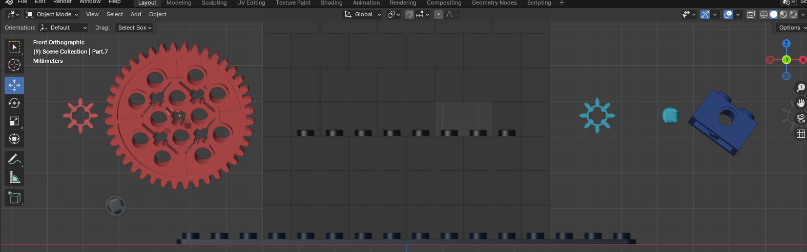

# Virtual Machines 0

The weirdest CTF challenge so ar.

Anyways, extract the `zip` file with `unzip`. It will provide a `dae` file.

Open the `Collade` file in `Blender`. Break apart the machine presented in the challenge.



Notice that the driver gear (red) has 40 teeth, and the blue teeth has 8.

That means that for one rotation of the driver gear, the `blue gear` has to complete 5 rotations.

Now that we have a constant, we need to perform the following operations,

```python
input = 39722847074734820757600524178581224432297292490103995912415595360101562905 # input
x = input * 5
hex_x = hex(x)
flag = bytes.fromhex(hex_x[2:]).decode('ascii')
print(flag)
```

This will give `picoCTF{g34r5_0f_m0r3_44af15eb}`, which is the answer.
