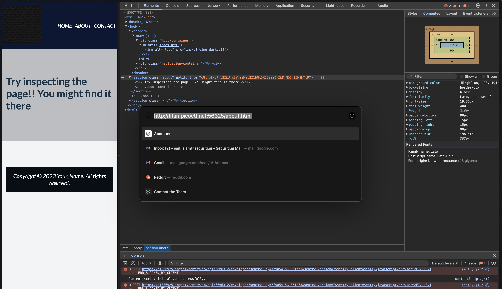

# WebDecode

## Description

If you inspect the `about` page,



You will find a base64 string. If you decode this, you will get the flag,

```sh
➜  WebDecode git:(main) ✗ echo "cGljb0NURnt3ZWJfc3VjYzNzc2Z1bGx5X2QzYzBkZWRfMDJjZGNiNTl9" | base64 -d
picoCTF{web_succ3ssfully_d3c0ded_02cdcb59}
```
