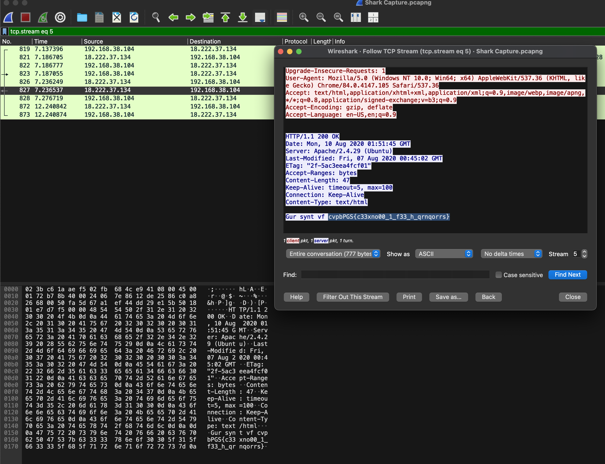
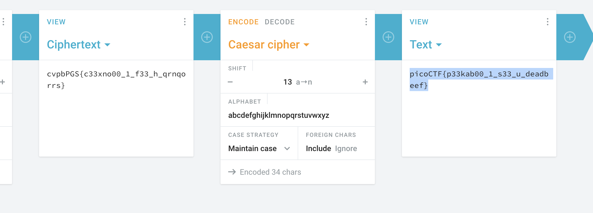

# Wireshark doo dooo do doo…

## Category

Forensics.

## Description

Can you find the flag? [shark1.pcapng](https://mercury.picoctf.net/static/81c7862241faf4a48bd64a858392c92b/shark1.pcapng).

## Solution

Download the file with,

```sh
curl -O https://mercury.picoctf.net/static/81c7862241faf4a48bd64a858392c92b/shark1.pcapng
```

Open the file in `Wireshark`. Visit the 5th stream, and follow the stream,



The text is encoded with `Caeser Cipher`. Decrypt it, and you get the flag. I used [Cryptii](https://cryptii.com/pipes/caesar-cipher).



The flag is `picoCTF{p33kab00_1_s33_u_deadbeef}`.
