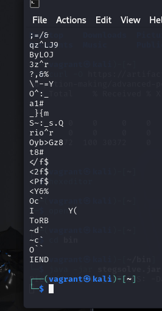

# Advanced Potion Making

## Description

Ron just found his own copy of advanced potion making, but its been corrupted by some kind of spell. Help him recover it!

Challenge Endpoints

- Download advanced-potion-making -> 	[advanced-potion-making](https://artifacts.picoctf.net/picoMini+by+redpwn/Forensics/advanced-potion-making/advanced-potion-making)

## Solution

Download this 'file',

```sh
curl -O https://artifacts.picoctf.net/picoMini+by+redpwn/Forensics/advanced-potion-making/advanced-potion-making
```

If you run `strings` on this file, you will find something peculiar,



Notice the `IEND` descriptor characteristic of the PNG file, but opening the file as a png causes issues.

We can use `hexeditor` to investigate the corruption,

```sh
hexeditor advanced-potion-making
```


We want an example of a what a non-corrupt PNG looks like, we find the below results from `google`,


This is what a proper file will look like,


We save the file as a png, and notice that it is all RED.


Luckily, we have `stegosolve`. If you are unaware, I also maintain a '[Kali Linux CTF](https://github.com/Rubix982/kali-linux-ctf)' repository.

In the installation script, it has a command on how to install `stegosolve`. 


We will run these commands. I am using a Kali Linux VM (also created through `vagrant` in the above repository).

Then, we will load the image into `stegosolve`.

If we shift to the 'red plane' view, we see our flag,


Hence, the flag is `picoCTF{w1z4rdry}`.
