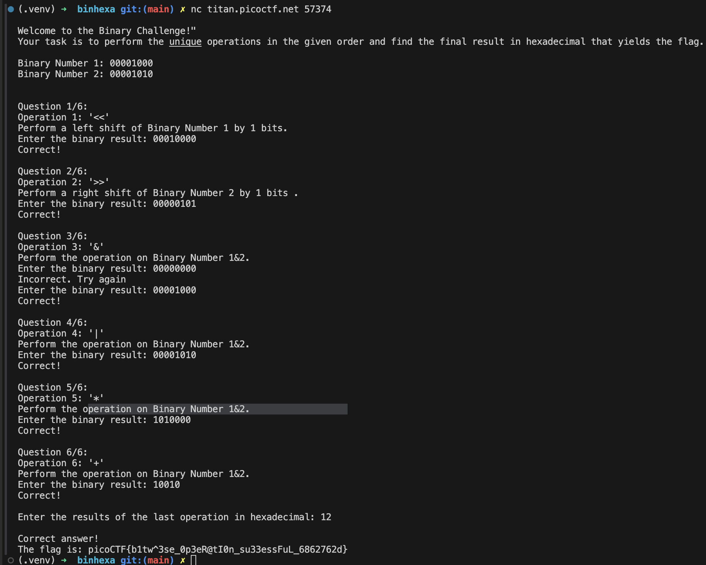

# Binhexa

## Description

How well can you perfom basic binary operations?

> Start searching for the flag here nc titan.picoctf.net 57374

## Solution

```sh
nc titan.picoctf.net 57374 # picoCTF{b1tw^3se_0p3eR@tI0n_su33essFuL_6862762d}
```


