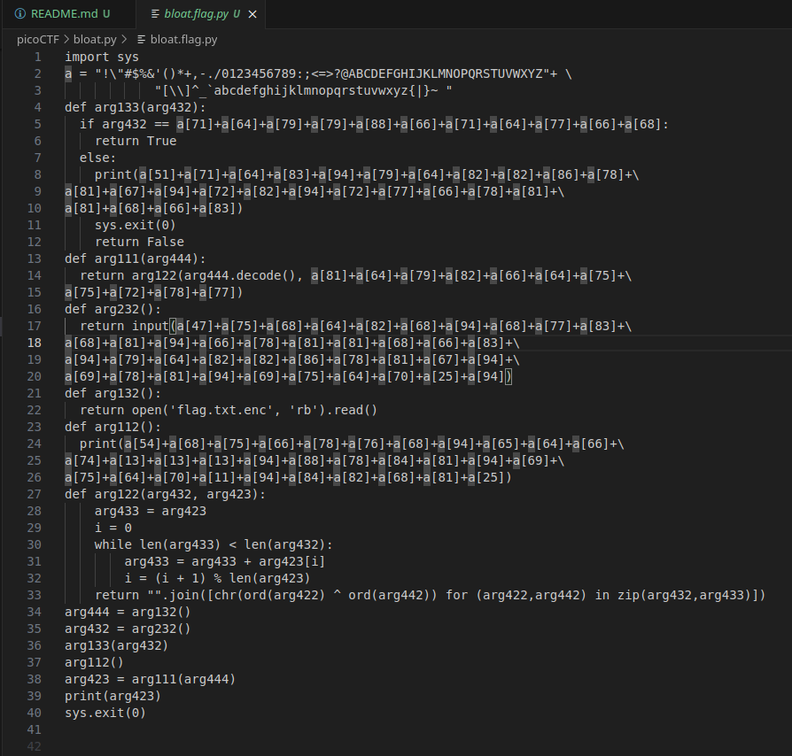

# bloat.py

We have this challenge,


We get two files from the links,

1. `bloat.flag.py`
2. `flag.txt.enc`

The `bloat.flag.py` is an obuscated mess,



If we run it,

```sh
(env) saif@saif:~/code/SecChapter/picoCTF/bloat.py$ python3 bloat.flag.py 
Please enter correct password for flag: 1
That password is incorrect
(env) saif@saif:~/code/SecChapter/picoCTF/bloat.py$
```

We do not get our flag this easily.

Let us try to cleanup the script a bit,

```python
import sys
a = "!\"#$%&'()*+,-./0123456789:;<=>?@ABCDEFGHIJKLMNOPQRSTUVWXYZ[\\]^_`abcdefghijklmnopqrstuvwxyz{|}~ "

def arg133(arg432):
  if arg432 == "happychance":
    return True
  else:
    print("That password is incorrect")
    sys.exit(0)
    return False

def getEncFlag():
  return open('flag.txt.enc', 'rb').read()

def arg122(arg432, arg423):
    arg433 = arg423
    i = 0
    while len(arg433) < len(arg432):
        arg433 = arg433 + arg423[i]
        i = (i + 1) % len(arg423)        
    return "".join([chr(ord(arg422) ^ ord(arg442)) for (arg422,arg442) in zip(arg432,arg433)])

encFlag = getEncFlag()
arg133(input("Please enter correct password for flag: "))
print("Welcome back... your flag, user:")
print(arg122(encFlag.decode(), "rapscallion"))
sys.exit(0)
```

We got things cleaned up a bit. If we pass in `happychance` now, we get the below output,

```sh
(env) saif@saif:~/code/SecChapter/picoCTF/bloat.py$ python3 bloat.flag.py 
Please enter correct password for flag: happychance
Welcome back... your flag, user:
picoCTF{d30bfu5c4710n_f7w_b8062eec}
```

So our flag is `picoCTF{d30bfu5c4710n_f7w_b8062eec}`.
