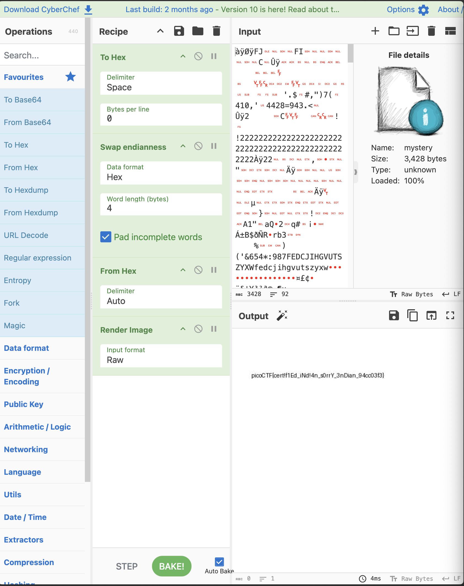

# endianness-v2

## Description

Here's a file that was recovered from a 32-bits system that organized the bytes a weird way. We're not even sure what type of file it is.
Download it [here](https://artifacts.picoctf.net/c_titan/114/challengefile) and see what you can get out of it

## Solution

This  was  difficult. As you can see, I played around with scripts to find how to actually see the image. I flipped the bits with my script, but could not form it back properly to render a JPEG.

I found this solution on [GitHub](https://github.com/noamgariani11/picoCTF-2024-Writeup/blob/main/Forensics/endianness-v2.md) that had this link for a [CyberChef](https://gchq.github.io/CyberChef/#recipe=To_Hex('Space',0)Swap_endianness('Hex',4,true)From_Hex('Auto')Render_Image('Raw')&input=4P/Y/0ZKEAABAEZJAQAAAQAAAQBDANv/BgYIAAgFBgcJBwcHDAoICQsMDRQSGQwLHRQPEx0eHxogHBwaICcuJBwjLCIpNygcNDEwLCcfNDQyOD05NDMuPADb/zIJCQFDDAsMCRgNDRghHCEyMjIyMjIyMjIyMjIyMjIyMjIyMjIyMjIyMjIyMjIyMjIyMjIyMjIyMjIyMjIyMjIywP8yMgAIEQADLAGWAgAiAREDAREAxP8BAQAAHwEBAQUAAQEBAAAAAAEAAAAFBAMCCQgHBsT/CwoAELUAAwMBAgUDBAIABAQFAX0BAAQAAwIhEgUREwZBMSIHYVGBMhRxIwihkRXBsUIk8NFSgnJiMxcWCgklGhkYKSgnJjY1NCo6OTg3RkVEQ0pJSEdWVVRTWllYV2ZlZGNqaWhndnV0c3p5eHeGhYSDiomIh5WUk5KZmJeWpKOimqinpqWzsqqpt7a1tMK6ubjGxcTDysnIx9XU09LZ2NfW4%2BLh2ufm5eTx6uno9fTz8vn49/YAxP/6AwABHwEBAQEBAQEBAAAAAQEAAAAFBAMCCQgHBsT/CwoAEbUABAIBAgcEAwQABAQFAHcCAREDAgExIQUEUUESBhNxYQcIgTIioZFCFCMJwbEV8FIzCtFyYuE0JBYYF/ElJyYaGTUqKSg5ODc2RURDOklIR0ZVVFNKWVhXVmVkY1ppaGdmdXRzanl4d3aEg4J6iIeGhZOSiomXlpWUopqZmKalpKOqqaintbSzsrm4t7bEw8K6yMfGxdPSysnX1tXU4trZ2Obl5OPq6ejn9fTz8vn49/YA2v/6AAEDDBEDEQL3AD8AgKIo%2BoCiKAqAoigKgKIoCoCiKAqAoigKgKIoCoCiKAqAoigKgKIoCoCiKAqAoigKgKIoCoCiKAqAoigKgKIoCoCiKAqAoigKgKIoCoCiKAqAoigKgKIoCoCiKAqAoigKgKIoCoCiKAqAoigKgKIoCoCiKAqAoigKgKIoCoCiKAqAoigKgKIoCoCiKAqAoigKgKIoCoCiKAqAoigKgKIoCoCiKAqAoigKgKIoCoCiKAqAoigKgKIoCoCiKAqAoigKgKIoCoCiKAqAoigKgKIoCoCiKAqAoigKgKIoCoCiKAqAoigKgKIoCoCiKAqAoigKgKIoCoCiKAqAoigKgKIoCoCiKAqAoigKgKIoCoCiKAqAoigKgKIoCoCiKAqAoigKgKIoCoCiKAqAoigKgKIoCoCiKApuqCgKbaztruLu4tqAVHgrKMKVZE8GgCT3AJIcFTUBNKa3Hp9XJKlKxQOv1p11wiQDQhUKLKDnnPIMejJdA0VGmG0Z0m4ltmoXua2YOEiJCY75eSE0gOJ4X0usKDx5QRPvjRUr1hnu2Xmq6NY4QQV3yHCbX1CwIFZm5MFxRsx4mw6aDC%2B6ZL%2BqTUDOhpjSzLm9xCi26Tnk/AMontdPsaKnjXoMiIzVraV7ayKW6h6Zi5GUx2hhJ8EYjjI5ZbUaAOP5o7v9an/ydix3%2BdhC%2BwZWCA5SYueYn1NCAyiOvNTJiiLpok9aqXlBFEvxxi7nRzJQRtroB3KGu25PDs7jI1V6Fuo8PXmSarap3JuT0hZ4IwKq3Bh2YMlZJ0AygNEBFLF48lzR27QJtt10uAtvL0lC246yJckqa2x2v5sX7gcK5xWnv1/axPNiy5aefrxn33qSGJa4zozlyWqskgyAIIZ2eIIkWxtA6Qc3N1Q0skbaMUirQkqosuSR6lUwy8dAUkcTAEhSM952WL2ibtNN5Yp0dJqinouh6Ih1BeK0ni%2BU58at/HqiAyhGDzWwohL2aBkFLsTdV5aW1KulszcN1pij3I3Umw8w3jGrGMmhnfW6d%2Bmmt451jXkSYawzqKM2IReA51w%2BpB4wQjUAEns6VqooM6qXzlmpny52qLLdhKzzFglO6CkNddPgstJLb2sL9S9R2vJ37ICSHBdiCaqlB8CpsaJfAGNLPK14D1c03IZpsvst0kY4WXgkjBiyjXMOBDFPM0aQlybxvP3yDGfP/imuSJDOsG2j0K7kDOP9nxgMKADN8%2B4sVVFrB3UYdZssELsZMKctgF0bCMjzths5PZUECFU7UvdoTXxB3VuyCRJicbBrVi5sFI%2BIZe/fFeen3EBjz8ELK6oNgNrE7x6XbBpsoi6ztmxF3LE3lrJjFkkybwFYXjVxpI7LG%2BJpS2mTi2vd2TI0LmiEq5RhNVrEMFJnfo4qMGfrflLXADgYt7%2Bzoi2xb/SHvfbna8xd2WNT2j8NlQQ4nABnnC1XA3q3uyDuo2mLS%2BQGGZqsDDaSGhxBPceKlgBtR3zSRRLLq9wKc29kbW5AiFsomGG6AIFP5gOJh/kBvIufHRVvyFv025E3Z5td2lus0zUzV%2BwjaVJ5EsrB92AcARKMI99lRbmwSot4Q96rE0shzCW0IsVaoAqxxFmScybMB85AJPy/KiTN1sgloWZaM7xyxB7GKlt3DFUWbYBwsc7NRyrcAIrh8ZS5ovzNjbXzNrZWMLa83ldCot6QlGTMjhFrg4BYLAEwP6%2BgiXdaqwv11GHdbXg7uLe6Y9ywM5QUqQSPfWTAiJAgGOeQYHtwoijKDaIoCoCiKAqA/OcKgHlza2elDdHh7Z%2B4uGUjTNaoW0glJ8CWmHGSAGhB1wTAl3AARS/VDV5a1OQvlaYoS1egneSZP4xm2pnIZocWVgnO5cBxfG%2BpAT7fqy9KiyGnX3u1hW553LKcAbf5/ewQieT8kOOVnignHEBR2%2Bumh/Z%2BGlw6jVnymKU8wTZZmh2VGitV4wgBlbI5hiQYVRPYK3Mz/O8XsQ579q0am6V6Z6%2BKZXRkG2%2BzL/dbZZTrHowP0dTtyLt2HECLq3vhb6cR63W3Y2hpuLp3EzzrMpZcrkaKVN4oHG6ccT5qqmI7tdQOoam7y8Hf0NOG4Xn2jCTi8uycbwavkufbdL9gyCjvWg/3Wg6gppKXw2Mb8LRnreY1KvcOf7ItwAoJkkKsDzA%2BMFXUB97Swz%2BNl3br2IkgyGhk6h01bq7FLPIRmGOylY%2BBtwxkO6Bo6FrC7zYOuumL2iQYMXy7WduS5EUZ1JSj27ZEApXcnofBUgzHGLlLsY4zR2J94QTsWGRXNupTcrc80kNeJM1kVpRFyGLly8MuR2Kit%2BsdKDUwgFHLde/s6TRot7Y3zI%2BXWwLEFYtkjl0wcuNQJcdKR3IgXvC5xUvKwqB1ku1p6%2BKe1S3ZNnNQuvGNgOv7OJz5eAZz15xncXAARZJSM3ixGzva0GBtZJKFtO6fZZkZ2GExzYhDyJgFez/JtWbzszQpfC/WsSa%2BkUv1Ldxc%2BLJXlidFgkiCYGP37qcwttAvc8xHzgEURV0e/mjJvG3Qu%2BcY4jySRittmK1oxjBWlgag7aYcLOfEjHHqUUcafsRPZFh81DZNtmS1das7BjI3uIkZRpQ3vmvMuVPJ4ScnCVlQNHel4XEjB/tTU832oc5FXZq6FXbiGDhrq/x4So45j0m3uYPRfYyB7LWmnuYNYXRD0iW/0p1aJMwZF8iKKN5iN6pHts198BwcQNFrd2%2BL9mgPv%2BFs9kf6a0GS92rNcxwAEuzxHfOxN9my5VhrfU7GusL3Kqtvpb4dnc6ZPpHm3bCIZ5wIwG43G2yU5Bt4gHagY/u%2BQFHbFeGxphzLi9urWjyNuwTTZAWD7EgxM0%2B3NgKcQgIPEKCsuqqgI421hadv6vBWzBeELTJ5RMVtaxzFUXUacyWX%2Bby8DSCIWnuOc9KJAyhDqCP87z1vdVmPSNknKNH%2By4KweSAzAMh0w2/LMZ0OAFdk%2BlrYpxW65z2dzj91eZuE8WqZkrhljal7B0XAGVfI31oPPb04gKLHU8E3MnXNLFvG4tq4seQYZWTFcjau6iwIF/fDg5MAufC1odLrpKtul/ZXF%2Bzo1zbpvRXpaGPRWHzc4y0MDIC4goF2G%2BckqIc4gKK6dUT4f3oasDVb5ZOma/sb3swfrI2byoTzBLX7cTtmyGxyqxhAlrQ66H1r5vdzauwqF5aXvHkcxg59mMZxIaKShI8lI/xo6wpML0oOoFL26g5aXJH5xAD/XmTKzrqvi8q6bxLPK29oW/kPEFg1pxhBKrwf3mgdHXXTsj%2BOJIxdWtneyEbE42hjWSCq1EFgAMl1XZ1%2BL0VRABRFUQAURVEAFEVRABRFUQAURVEAFEVRABRFUQAURVEAFEVRABRFUQAURVEAFEVRABRFUQAURVEAFEVRABRFUQAURVEAFEVRABRFUQAURVEAFEVRABRFUQAURVEAFEVRABRFUQAURVEAFEVRABRFUQAURVEAFEVRABRFUQAURVEAFEVRABRFUQAURVEAFEVRABRFUQAURVEAFEVRABRFUQAURVEAFEVRABRFUQAURVEAFEVRABRFUQAURVEAFEVRABRFUQAURVEAFEVRABRFUQAURVEAFEVRABRFUQAURVEAFEVRABRFUQAURVEAFEVRABRFUQAURVEAFEVRABRFUQAURVEAFEVRABRFUQAURVEAFEVRABRFUQAURVEAFEVRABRFUQAURVEAFEVRABRFUQAURVEAFNn/ARQ). Providing the file as input rendered the flag as a JPEG.

The flag is `picoCTF{cer!f1Ed_iNd!4n_s0rrY_3nDian_94cc03f3}`.
