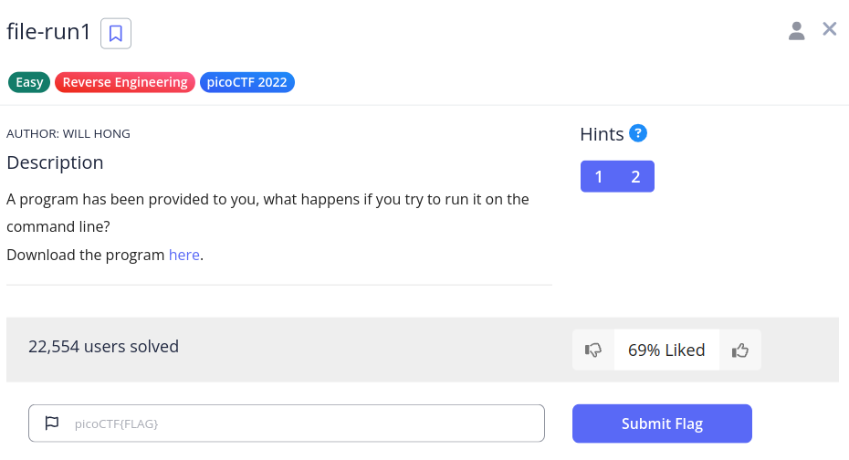

# file-run1

We have the below challenge,



The link gives us a file named `run`.

There is nothing else left to do,

```sh
(env) saif@saif:~/code/SecChapter/picoCTF/file-run1$ touch README.md
(env) saif@saif:~/code/SecChapter/picoCTF/file-run1$ mv ~/Downloads/run .
(env) saif@saif:~/code/SecChapter/picoCTF/file-run1$ sudo chmod +x run
(env) saif@saif:~/code/SecChapter/picoCTF/file-run1$ ./run 
The flag is: picoCTF{U51N6_Y0Ur_F1r57_F113_e5559d46}
```

As it says, the flag is `picoCTF{U51N6_Y0Ur_F1r57_F113_e5559d46}`.
