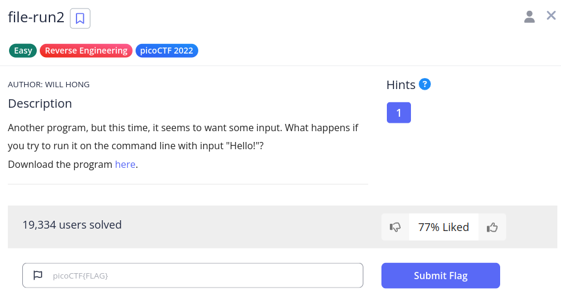

# file-run2

We have this challenge,



From the download, we get a file named `run`.

From then onwards, it was quite simple,

```sh
(env) saif@saif:~/code/SecChapter/picoCTF/file-run2$ ./run 
Run this file with only one argument.
(env) saif@saif:~/code/SecChapter/picoCTF/file-run2$ ./run 1
Won't you say 'Hello!' to me first?
(env) saif@saif:~/code/SecChapter/picoCTF/file-run2$ ./run 2
Won't you say 'Hello!' to me first?
(env) saif@saif:~/code/SecChapter/picoCTF/file-run2$ ./run 3
Won't you say 'Hello!' to me first?
(env) saif@saif:~/code/SecChapter/picoCTF/file-run2$ ./run "Hello!"
The flag is: picoCTF{F1r57_4rgum3n7_be0714da}
```

The flag is `picoCTF{F1r57_4rgum3n7_be0714da}`.
