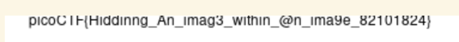

# hideme

## Description

Every file gets a flag.
The SOC analyst saw one image been sent back and forth between two people. They decided to investigate and found out that there was more than what meets the eye [here](https://artifacts.picoctf.net/c/262/flag.png).

## Solution

If we run `binwalk` on the flag, we get a strange output,

```sh
(env) ➜  hideme git:(main) ✗ binwalk flag.png 

                        /Users/saif.islam/code/SecChapter/picoCTF/hideme/flag.png
---------------------------------------------------------------------------------------------------------
DECIMAL                            HEXADECIMAL                        DESCRIPTION
---------------------------------------------------------------------------------------------------------
0                                  0x0                                PNG image, total size: 39739 bytes
39739                              0x9B3B                             ZIP archive, file count: 2, total 
                                                                      size: 3206 bytes
---------------------------------------------------------------------------------------------------------

Analyzed 1 file for 85 file signatures (187 magic patterns) in 5.0 milliseconds
```

A `ZIP Archive`? Strange. Lets try running the `unzip` command on the PNG,

```sh
(env) ➜  hideme git:(main) ✗ unzip flag.png 
Archive:  flag.png
warning [flag.png]:  39739 extra bytes at beginning or within zipfile
  (attempting to process anyway)
   creating: secret/
  inflating: secret/flag.png         
(env) ➜  hideme git:(main) ✗ ls
README.md    flag.png     outputSB.txt secret
(env) ➜  hideme git:(main) ✗ ls secret 
flag.png
```

If we open the extracted flag in the `secrets` folder, we see this,



Thus, the flag is `picoCTF{Hiddinng_An_Imag3_within_@n_Ima9e_82101824}`.
