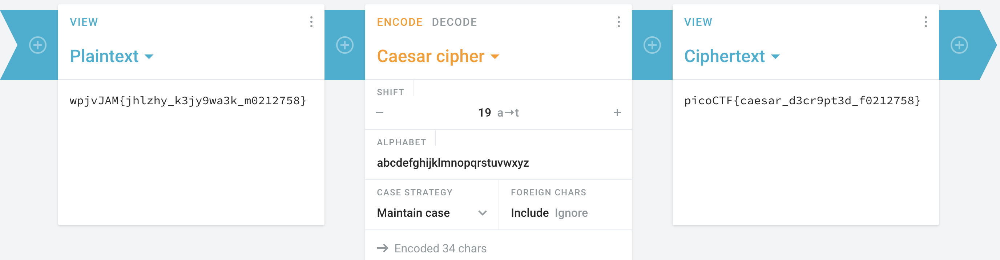

# interencdec

## Description

Can you get the real meaning from this file.
Download the file [here](https://artifacts.picoctf.net/c_titan/109/enc_flag).

## Solution

```sh
curl -LO https://artifacts.picoctf.net/c_titan/109/enc_flag
result=$(cat enc_flag | base64 -d)
result="${result:2}"
result="${result:0:${#result} - 1}"
result=$(echo "$result" | base64 -d)
echo "$result" # wpjvJAM{jhlzhy_k3jy9wa3k_m0212758}
```

> Did you know that Julius Caeser still receives flowers at his grave?



Flag -> `picoCTF{caesar_d3cr9pt3d_f0212758}`.
