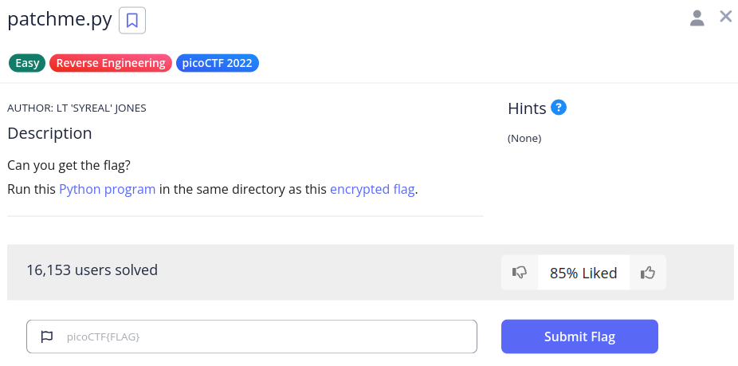

# patchme.py

We have this challenge,



These two files are,

1. `flag.txt.enc`
2. `patchme.flag.py`

Thank God for `pyenv` (setting up and using Python is a nightmare).

In the `patchme.flag.py` file, we see the below code block,

```python
def level_1_pw_check():
    user_pw = input("Please enter correct password for flag: ")
    if( user_pw == "ak98" + \
                   "-=90" + \
                   "adfjhgj321" + \
                   "sleuth9000"):
        print("Welcome back... your flag, user:")
        decryption = str_xor(flag_enc.decode(), "utilitarian")
        print(decryption)
        return
    print("That password is incorrect")
```

If we pass in this flag after we run the program and give it input, we will get the following output,

```sh
(env) saif@saif:~/code/SecChapter/picoCTF/patchme.py$ python3 patchme.flag.py 
Please enter correct password for flag: ak98-=90adfjhgj321sleuth9000
Welcome back... your flag, user:
picoCTF{p47ch1ng_l1f3_h4ck_f01eabfa}
```

So, `picoCTF{p47ch1ng_l1f3_h4ck_f01eabfa}` is our flag.
