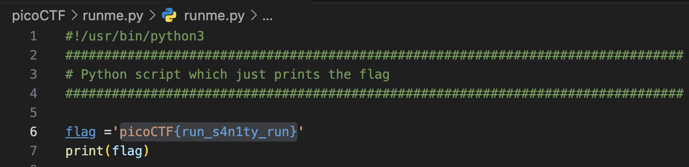

# runme.py

## Description

Run the runme.py script to get the flag. Download the script with your browser or with wget in the webshell.

[Download runme.py Python script](https://artifacts.picoctf.net/c/34/runme.py).

## Solution

```sh
curl -LO https://artifacts.picoctf.net/c/34/runme.py
```

?



Flag -> `picoCTF{run_s4n1ty_run}`.
