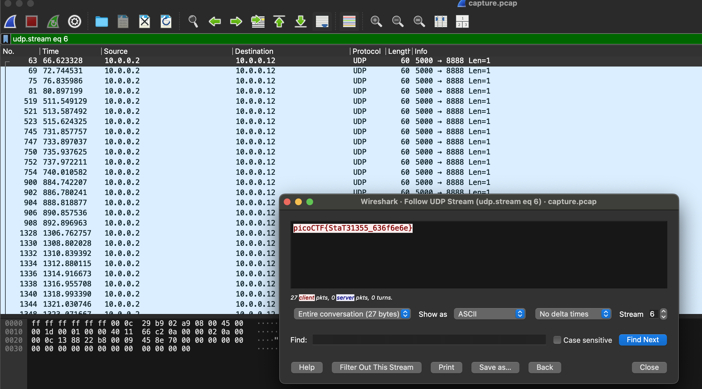

# shark on wire 1

## Description

We found this [packet capture](https://jupiter.challenges.picoctf.org/static/483e50268fe7e015c49caf51a69063d0/capture.pcap). Recover the flag.

## Solution

```sh
curl -LO https://jupiter.challenges.picoctf.org/static/483e50268fe7e015c49caf51a69063d0/capture.pcap
```

Look at `udp.stream eq 6`,



Flag -> `picoCTF{StaT31355_636f6e6e}`.