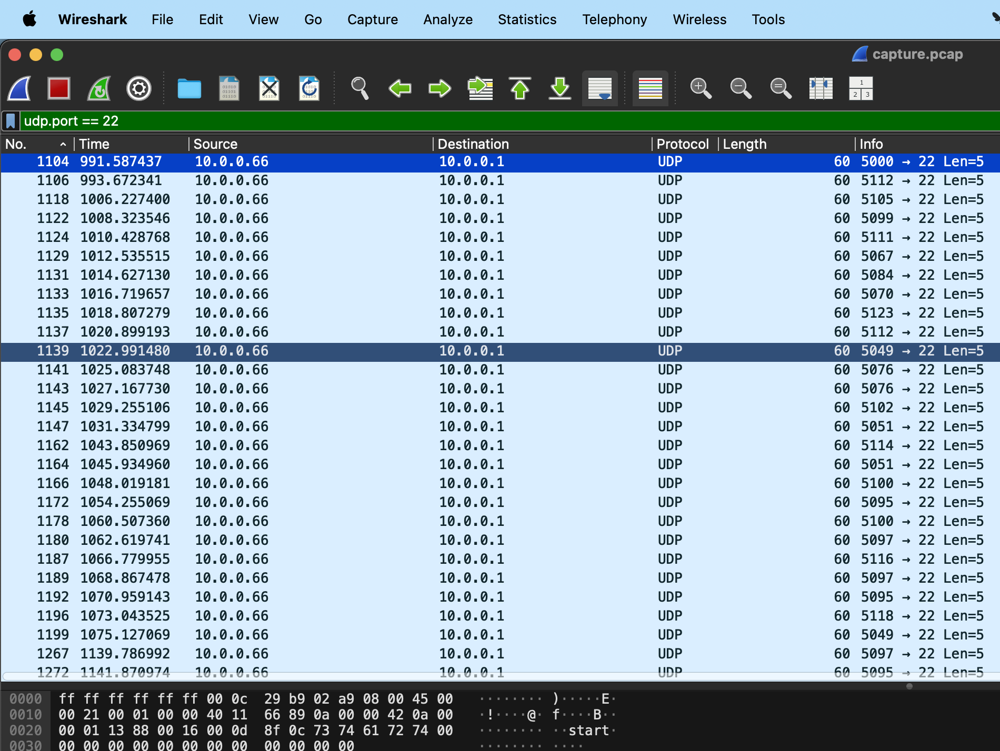
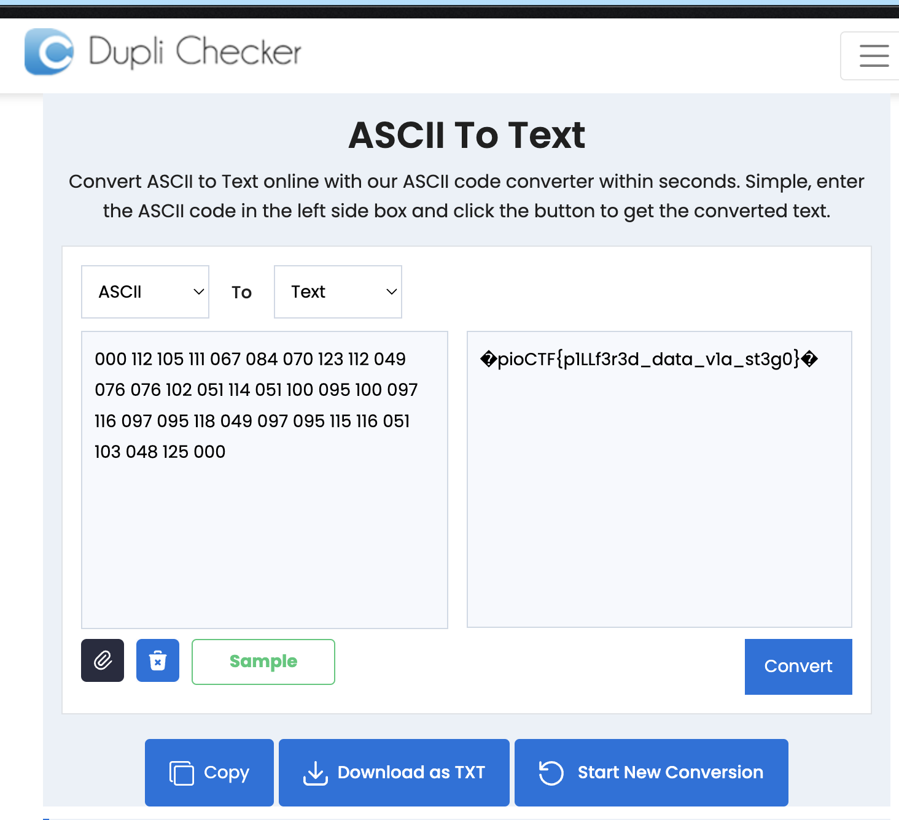

# Shark on wire 2

## Description

We found this [packet capture](https://jupiter.challenges.picoctf.org/static/b506393b6f9d53b94011df000c534759/capture.pcap). Recover the flag that was pilfered from the network.

## Solution

```sh
curl -LO https://jupiter.challenges.picoctf.org/static/b506393b6f9d53b94011df000c534759/capture.pcap
```

If you filter on `udp.port == 22`, you will such a view,



Notice that the same source IP sends packets to the destination IP from different ports directed at the same destination port. All of the source port numbers start with `5`. If we take the last three digit of each row, we will get the below output,

```text
112 105 099 111 067 084 070 123 112 049 076 076 102 051 114 051 100 095 100 097 116 097 095 118 049 097 095 115 116 051 103 048 125
```

This looks like ASCII. Lets check,



Flag -> `picoCTF{p1LLf3r3d_data_v1a_st3g0}`.
