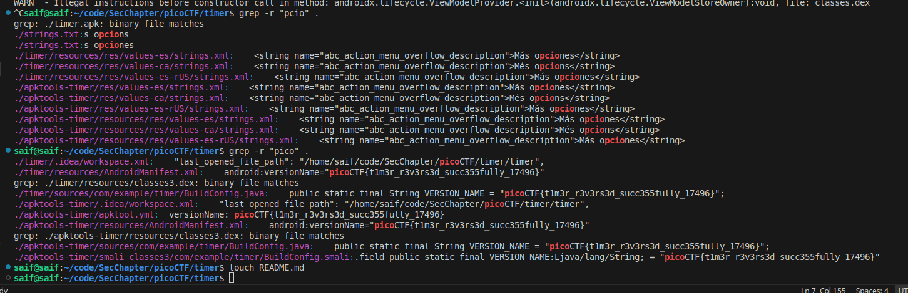

# Timer

While the solution is, the tooling should be extensively explored to understand the varying complexities of APK and mobile app deconstruction.

For example, learning about tools such as `jadx` and `apktools`.

To solve this challenge, quite simply disasemble the `.apk` with `jadx`, and run `grep -r "pico" .` in the created directory to find mentions of the flag.

