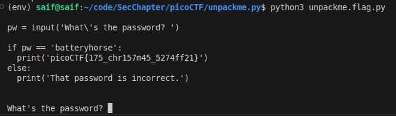

# unpackme.py

Reader, `python` is an abomination. I wanted to make it clear. I spent 30 minutes just trying to install a package, and almost purged major system level changes. :(

Anyway, the answer is quite simple. Just add `print(plain.decode())` before calling `exec`, and you should see the flag there.

Here is your answer -> `picoCTF{175_chr157m45_5274ff21}`.
