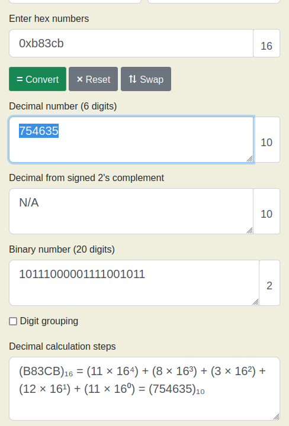

# unpackme

Pretty simple, actually!

Just download `upx`. I setup a path to the binary from the repository to use it on my CLI.


Unpack with `upx -d unpackme-upx`.

In my case, I decompressed the binary into a new file called `unpackme-upx-unpacked`.

Then I ran `strings` on the file, but I did not get a flag when I tried to `grep` for `pico`.

Then I used the online decompiler to get the actual code behind it, and outputted it to `snowman.c`.


I noted that since these are executables, I can execute them with `chmod +x unpackme-upx-unpacked`.

Then I executed the binary, and I was given a prompt that asked me the following,

```text
saif@saif:~/code/SecChapter/picoCTF/unpackme$ ./unpackme-upx-unpacked 
What's my favorite number?
```

I searched for the string `What's my` in the generated `.c` file, and I found the below method,

```c
void** fun_401e46(int32_t edi, void** rsi) {
    void* rbp3;
    void** rax4;
    void* rsi5;
    int32_t v6;
    void** rax7;
    void** rdx8;
    void** rcx9;
    int64_t r8_10;
    uint64_t r9_11;
    void** rax12;
    uint64_t rcx13;

    __asm__("cli ");
    rbp3 = reinterpret_cast<void*>(reinterpret_cast<int64_t>(__zero_stack_offset()) - 8);
    rax4 = tcache;
    _IO_printf("What's my favorite number? ");
    rsi5 = reinterpret_cast<void*>(reinterpret_cast<int64_t>(rbp3) - 60);
    __isoc99_scanf("%d", rsi5);
    if (v6 != 0xb83cb) {
        _IO_puts("Sorry, that's not it!", rsi5);
    } else {
        rax7 = rotate_encrypt(0, reinterpret_cast<int64_t>(rbp3) - 48);
        rdx8 = stdout;
        fputs(rax7, rdx8, rdx8, rcx9, r8_10, r9_11, rsi);
        putchar(10, rdx8);
        free(rax7, rax7);
    }
    *reinterpret_cast<int32_t*>(&rax12) = 0;
    *reinterpret_cast<int32_t*>(&rax12 + 4) = 0;
    rcx13 = reinterpret_cast<unsigned char>(rax4) ^ reinterpret_cast<unsigned char>(tcache);
    if (rcx13) {
        rax12 = __stack_chk_fail();
    }
    return rax12;
}
```

We can see that we are checking against a constant after taking the input.

We can also note that the constant is a hex -> `0xb83cb`.

If we convert this `hex` to `decimal`, we can get `75635`.



If we give this number to the prompt, we get our flag,

```text
saif@saif:~/code/SecChapter/picoCTF/unpackme$ ./unpackme-upx-unpacked 
What's my favorite number? 754635
picoCTF{up><_m3_f7w_e510a27f}
```

So `picoCTF{up><_m3_f7w_e510a27f}` is the answer.
