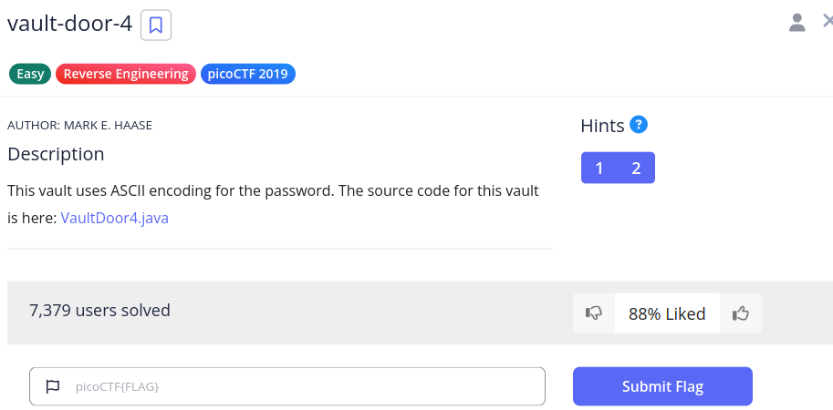

# Vault Door 4

We have this challenge,



We get this method now,

```java
    // I made myself dizzy converting all of these numbers into different bases,
    // so I just *know* that this vault will be impenetrable. This will make Dr.
    // Evil like me better than all of the other minions--especially Minion
    // #5620--I just know it!
    //
    //  .:::.   .:::.
    // :::::::.:::::::
    // :::::::::::::::
    // ':::::::::::::'
    //   ':::::::::'
    //     ':::::'
    //       ':'
    // -Minion #7781
    public boolean checkPassword(String password) {
        byte[] passBytes = password.getBytes();
        byte[] myBytes = {
            106 , 85  , 53  , 116 , 95  , 52  , 95  , 98  ,
            0x55, 0x6e, 0x43, 0x68, 0x5f, 0x30, 0x66, 0x5f,
            0142, 0131, 0164, 063 , 0163, 0137, 070 , 0146,
            '4' , 'a' , '6' , 'c' , 'b' , 'f' , '3' , 'b' ,
        };
        for (int i=0; i<32; i++) {
            if (passBytes[i] != myBytes[i]) {
                return false;
            }
        }
        return true;
    }
```

I do not like breaking hearts. Sorry minion #7781.

Anyways, we see two kinds of bases here, `ASCII`, `Hex`, and the `Octa` format format.

We can convert from `ASCII` with this guide from [CMU](https://www.cs.cmu.edu/~pattis/15-1XX/common/handouts/ascii.html),

1. 106 -> j
2. 85 -> U
3. 53 -> 5
4. 116 -> t
5. 95 -> _
6. 52 -> 4
7. 95 -> _
8. 98 -> b

This part is `jU5t_4_b`.

First we convert `hex` and `octal` to integers with [rapidTable](https://www.rapidtables.com/convert/number/hex-to-decimal.html).

1. 0x55 -> 85 -> U
2. 0x6e -> 110 -> n
3. 0x43 -> 67 -> C
4. 0x68 -> 104 -> h
5. 0x5f -> 95 -> _
6. 0x30 -> 48 -> 0
7. 0x66 -> 102 -> f
8. 0x5f -> 95 -> _

This part is `UnCh_0f_`.

Then we convert `octal` to `dec`,

1. 0142 -> 98 -> b
2. 0131 -> 89 -> Y
3. 0164 -> 116 -> t
4. 063 -> 51 -> 3
5. 0163 -> 115 -> s
6. 0137 -> 95 -> _
7. 070 -> 56 -> 8
8. 0146 -> 102 -> f

This part is `bYt3s_8f`.

Together, we get this string -> `jU5t_4_bUnCh_0f_bYt3s_8f`

Combining it with the characters at the end of the list, `4a6cbf3b`, we get this -> `jU5t_4_bUnCh_0f_bYt3s_8f4a6cbf3b`.

So our flag is `picoCTF{jU5t_4_bUnCh_0f_bYt3s_8f4a6cbf3b}`.
