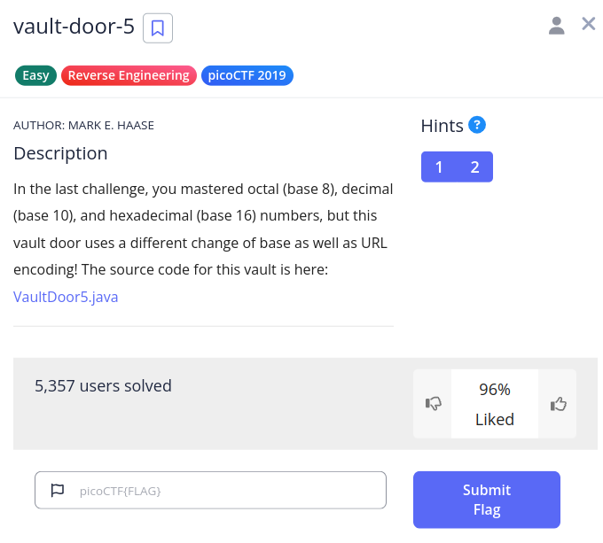

# Vault Door 5

We have this challenge,



Add print statements to the below method,

```java
    public boolean checkPassword(String password) {
        System.out.println(password);
        System.out.println(password.getBytes());
        String urlEncoded = urlEncode(password.getBytes());
        System.out.println(urlEncoded);
        System.out.println(urlEncoded.getBytes());
        String base64Encoded = Base64.getEncoder().encodeToString(urlEncoded.getBytes());
        System.out.println(base64Encoded);
        String expected = "JTYzJTMwJTZlJTc2JTMzJTcyJTc0JTMxJTZlJTY3JTVmJTY2JTcyJTMwJTZkJTVmJTYyJTYxJTM1JTY1JTVmJTM2JTM0JTVmJTY1JTMzJTMxJTM1JTMyJTYyJTY2JTM0";
        System.out.println(expected);
        // %63%30%6e%76%33%72%74%31%6e%67%5f%66%72%30%6d%5f%62%61%35%65%5f%36%34%5f%65%33%31%35%32%62%66%34
        return base64Encoded.equals(expected);
    }
```

The numbers in the comment are the decoded UTf 8 version of th `expected` string. Each value is a `hex` value.

If we convert each,

1. 0x63 -> 99 -> c
2. 0x30 -> 48 -> 0
3. 0x6e -> 110 -> n
4. 0x76 -> 118 -> v
5. 0x33 -> 51 -> 3
6. 0x72 -> 114 -> r
7. 0x74 -> 116 -> t
8. 0x31 -> 49 -> 1
9. 0x6e -> 110 -> n
10. 0x67 -> 103 -> g
11. 0x5f -> 95 -> _
12. 0x66 -> 102 -> f
13. 0x72 -> 114 -> r
14. 0x30 -> 48 ->  0
15. 0x6d -> 109 -> m
16. 0x5f -> 95 -> _
17. 0x62 -> 98 -> b
18. 0x61 -> 97 -> a
19. 0x35 -> 53 -> 5
20. 0x65 -> 101 -> e
21. 0x5f -> 95 -> _
22. 0x36 -> 54 -> 6
23. 0x34 -> 52 -> 4
24. 0x5f -> 95 -> _
25. 0x65 -> 101 -> e
26. 0x33 -> 51 -> 3
27. 0x31 -> 49 -> 1
28. 0x35 -> 53 -> 5
29. 0x32 -> 50 -> 2
30. 0x62 -> 98 -> b
31. 0x66 -> 102 -> f
32. 0x34 -> 52 -> 4

So we get the string `c0nv3rt1ng_fr0m_ba5e_64_e3152bf4`.

Hence our flag is `picoCTF{c0nv3rt1ng_fr0m_ba5e_64_e3152bf4}`.
